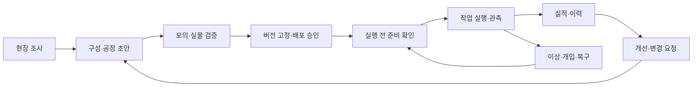

# 04. 구성부터 운영까지의 사용자 흐름

현재 인계 상태: **소프트웨어 구현 초안 v0.1 마감(2026-09-13)**. 아래 내용은 선행 제품·설계 기준이며, 확인된 구현과 미결은 [초안 인계](implementation/draft_handoff.md)와 [핵심 미결](implementation/critical_open_items.md)을 기준으로 읽는다.

[전체 문서 안내](/Users/ojaehong/RX_automation/rx_ws/README.md) · 사용자 경험과 운영 책임 제안

## 1. 구성·검증·허가와 실행·운영의 관계

두 영역은 **책임과 변경 시점을 구분하고, 동일한 버전·기록으로 연결**한다. 엔지니어는 공정과 장비 구성을 만들고 검증한다. 운영자는 승인된 패키지로 작업을 실행한다. 하나의 앱에 역할별 화면으로 구현할 수 있으며, 이 구분이 두 개의 대규모 제품을 먼저 만들라는 뜻은 아니다.

검증된 패키지라도 실행 순간의 장비 상태·제어권·자원 조건을 다시 확인해야 한다. 사전 검토 승인과 Runtime 실행 허가, 장비 측 인터록은 서로 다른 판단이다.

이 그림은 제품 사용 흐름이다. 로봇·척·문의 실제 물리 동작 순서를 나타내지 않는다.

## 2. 단계별 업무와 산출물

| 단계 | 주 담당 역할 | 수행할 일 | 다음 단계에 넘길 것 |
|---|---|---|---|
| 현장 조사 | 공정·기구·제어 엔지니어 | 작업·품목·노동·접속·안전 경계 조사 | 요구사항, 책임표, 미확인 항목 |
| 구성 | 통합 엔지니어 | 장비·어댑터·프로파일·tool·교정 등록 | 현장 구성 revision |
| 공정 작성 | 공정 엔지니어 | 작업·분기·병행·개입·복구 정의 | 공정 버전과 필요한 능력 |
| 검증 | 개발·시험·현장 담당 | 계약·모의·장비·셀 시험 | 적용 범위가 명시된 시험 기록 |
| 배포 | 릴리스·현장 책임자 | 조합·변경 영향·운영 절차 확인 | 배포 명세와 실행 가능 패키지 |
| 준비 | 작업자와 Runtime | 소재·품목·장비 모드·제어권 확인 | 실행 조건과 작업지시 |
| 운전 | 작업자·공정 실행기 | 시작·진행·중단 요청과 관측 | 작업 상태·완료·이상 이력 |
| 복구 | 권한 있는 현장 담당 | 원인·현재 상태·미결 명령 확인 | 복구 조치와 재개 근거 |
| 유지보수 | 지원·현장 담당 | 진단·수정·버전 교체·재검증 | 지원 기록과 새 패키지 |

역할은 책임 단위다. 작은 팀에서는 한 사람이 여러 역할을 맡을 수 있지만, 누가 검토·배포·개입했는지는 기록한다.

## 3. 구성 도구의 최소 화면

| 화면 | 반드시 보여줄 것 | 허용할 조작 |
|---|---|---|
| 현장·장비 | 실제 모델, 설치 버전, 프로파일, 연결 상태 | 등록·설정 초안·진단 |
| 기능·신호 | 지원·미지원·미검증, 원본 값과 품질, 실제 의미 | 담당자 검토와 매핑 작성 |
| 공정 | 버전, 입력, 장비 요구, 조건·복구 흐름 | 초안 작성·복사·검토 요청 |
| 검증 | 모의·장비·셀 시험 범위와 미해결 항목 | 시험 실행·증거 연결 |
| 배포 | 적용 조합과 변경점·필수 재검증 | 권한 있는 배포 승인·활성 버전 선택 |

미사용 접점처럼 보이는 단자를 자동으로 ‘사용 가능’으로 승인하지 않는다. 도면·PLC 프로그램·전기 조건·실제 동작 확인에 따른 매핑만 운영 프로파일에 넣는다.

## 4. 작업자 운영 흐름

작업자는 품목·작업 수량·사용 공정 버전을 선택하고 장비 준비 상태를 확인한다. 실행할 수 없는 경우에는 버튼 비활성화만 하지 않고 어떤 조건이 부족한지 보여준다. 시작 요청 이후에는 ‘요청 기록됨’, ‘장비 접수 확인’, ‘진행 중’, ‘완료’가 구분돼야 한다.

| 화면 요소 | 표시할 의미 |
|---|---|
| 현재 작업 | 품목, 지시 수량, 공정 버전, 진행 단계 |
| 장비 상태 | 연결뿐 아니라 운전 모드·제어권·관측 유효성 |
| 진행·실적 | 확인된 완료 수량, 진행·보류·실패·불명 수량 |
| 이상 | 원인 범주, 발생 시각, 영향을 받는 장비·작업 |
| 다음 조치 | 누가 무엇을 확인해야 하는지와 가능한 절차 |
| 중단 | 요청 종류·대상과 요청 접수/실제 확인 상태 |

정상 작업자 화면에는 SDK 클래스·raw register·ROS topic 같은 구현 세부를 노출하지 않는다. 상세 진단 화면에서는 지원 담당자가 원본 오류·신호·버전을 추적할 수 있어야 한다.

## 5. 통신이 끊겼을 때의 운영 예

예시는 문 닫기 작업의 의미를 설명하기 위한 것이며 실제 레이저 신호가 확정됐다는 뜻은 아니다.

1. RX가 요청을 기록하고 PLC에 전달한다.
2. PLC의 결과를 받기 전에 통신이 끊긴다.
3. 화면은 문이 닫혔다거나 실패했다고 확정하지 않고, 결과 확인 불가와 보류된 후속 작업을 표시한다.
4. 연결 복구 후 해당 요청의 결과·현재 문 상태·잔류 명령을 확인한다.
5. 자동 판별할 수 없으면 정의된 현장 확인 절차를 안내한다.
6. 재개 조건이 확보되면 권한 있는 재개 요청을 처리하고 그 근거를 남긴다.

작업자가 알림을 확인했다는 사실은 물리 상태 확인과 다르다. ‘알림 읽음’, ‘현장 확인’, ‘복구 조치’, ‘재개 허가’를 별도 행위로 기록한다. 개입은 자동 성공으로 위장하지 않는다.

## 6. 수동 조작과 자동운전 복귀

작업자가 펜던트·장비 HMI에서 수동으로 움직이면 자동 공정이 가정한 위치·소재 보유·척 상태가 달라질 수 있다. 제어권·모드 변경을 감지할 수 있는 수단과 감지 불가능한 경우의 운영 절차를 프로파일에 적는다.

자동운전 복귀는 로봇 전원을 켜거나 프로그램을 다시 시작하는 동작과 동일하지 않다. 현재 상태, 이전 미결 작업, 선택된 공정과 tool·교정, 필요한 초기화·점검을 확인하고 새 실행 조건을 확보하는 절차다.

## 7. 운영 중 구성 변경

실행 중인 작업은 시작할 때 적용한 패키지 버전을 참조한다. 엔지니어의 수정은 새 초안으로 만들고 현재 실행의 파라미터를 조용히 덮어쓰지 않는다. 진행 중 적용이 꼭 필요한 변경은 어떤 상태에서 어떤 범위까지 가능한지 별도로 설계·검증한다.

장비 firmware·PLC 프로그램·tool 교정처럼 외부에서 바뀌는 요소도 버전 일치 확인 대상으로 둔다. 자동 검출이 불가능하면 현장 변경 절차와 확인 기록으로 관리한다.

## 8. 운영 데이터가 제품 개선으로 이어지는 흐름

운영에서 발생한 개입·정지·진단을 작업·장비·패키지 버전에 연결한다. 반복 문제를 공통 제품 결함, 특정 어댑터 결함, 현장 설정·기구 문제, 운영 절차 문제로 분석한다. 분류는 책임 전가가 아니라 수정 위치와 필요한 검증을 찾기 위한 것이다.

다음 문서: [05 소프트웨어 구조](/Users/ojaehong/RX_automation/rx_ws/docs/05_software_architecture.md).
