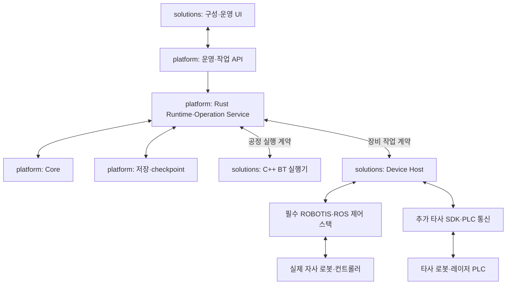

# RX 구체 구조 제안 — 두 컨테이너 경계 반영

> 2026-09-10 현재 계약의 규범 기준은 [RX 계약·프로토콜 v1.0](contracts/v1.0/README.md)이다. 이 문서의 선행 제안·예시는 v1.0과 충돌하면 대체된다. 자사 기본 지원 의무·두 이미지 경계는 유지하며, 실제 구현·실물 검증은 별도다.

[작업 공간 안내](../README.md) · 설계 단계 · 언어·의존성 분석은 [12 문서](12_stack_and_container_proposal.md)

## 1. 구성

선택된 Rust 코어를 기준으로 ROS 비의존 platform과 자사 스택을 필수 포함한 C++/ROS solutions를 설계한다. 각각의 컨테이너를 기본 배포 조합으로 둔다. 공통 작업 상태·기록은 platform이 소유하고, BT·Adapter·ROS 제어·UI·현장 패키지는 solutions에 배치한다.

이는 요청·관측 흐름이며 특정 물리 공정의 실행 순서가 아니다. 두 컨테이너 안의 프로세스 수를 둘로 제한하지 않는다.

## 2. 경계별 계약

| 계약 | 내용 | 원본 상태 |
|---|---|---|
| 운영 API | 공정·패키지·작업지시·시작·중단·개입·조회 | platform |
| WorkflowExecutorPort | 실행 ID·패키지·허가 세대·checkpoint·단계 진행·중단·재개 | 실행의 기록·판정은 platform, BT 진행 구현은 solutions |
| DevicePort | 장비 능력·접수·관측·결과·중단·재조정 | 원본 관측은 장비/Adapter, 작업 결론은 platform |
| ExecutionStore | 요청·사건·현재 상태·checkpoint·적용 버전 | platform |

UI는 HTTP/JSON·SSE, 컨테이너 간 실행/장비 계약은 gRPC/Protobuf를 우선 검토한다. 서버·생성기·프로토콜 버전은 함께 고정한다. 도메인 코어가 RPC 객체·ROS 메시지·데이터베이스 연결을 직접 사용하지 않도록 한다.

## 3. 작업 실행 흐름

1. UI가 검증된 패키지·공정·품목으로 platform에 시작을 요청한다.
2. platform이 주체·범위·준비 조건을 확인하고 run ID·패키지 버전·실행 세대를 기록한다.
3. solutions의 BT 실행기가 허가된 실행을 시작하고 각 활성화의 operation ID로 작업을 요청한다.
4. platform이 입력 동일성·능력·근거·자원 조건을 판정하고 필요한 의도를 영속 기록한다.
5. platform이 지정 Adapter에 전달하고 Host 접수·장비 접수·관측·결론을 구분해 처리한다.
6. 기록된 결과·checkpoint를 BT와 UI에 통지한다. 다음 작업은 별도 조건을 충족할 때 진행한다.

RPC 성공은 물리 완료가 아니다. BT의 반복 tick이 새 명령을 반복 생성하지 않도록 하며, UNKNOWN을 일반 FAILURE로 축소해 자동 fallback·재시도를 실행하지 않는다.

## 4. 재시작·세대·중복

Runtime, BT 실행기, Device Host의 부팅·실행 세대를 구분한다. Describe와 세대 결합 절차에서 버전·미결 실행을 대조한다. 새 platform 세대를 수락할 때 전송 진입과 세대 교체를 직렬화하여 이전 세대의 확실한 미전달 대기를 무효화하고, 이미 전달됐을 가능성이 있는 요청은 재조정 대상으로 남긴다.

platform은 최초 장비 전달 전에 run·단계 활성화·operation ID의 연결을 기록한다. BT만 재시작하는 경우 새 활성화나 새 작업 ID를 임의로 만들지 않고, platform의 기존 ID·checkpoint·완료 결과를 대조해 복원한다. 장비가 완료됐지만 BT가 결과를 받지 못했던 작업을 재실행하지 않는다.

Host 접수의 첫 구현은 volatile일 수 있으므로 그 보존 수준을 선언한다. Host가 재시작해 기록이 없다는 이유로 미실행으로 판정하지 않는다. platform의 영속 전달 이력과 장비 상태·잔류 명령을 대조하기 전에는 관련 신규 동작을 허가하지 않는다.

solutions 컨테이너 재시작 시 BT와 Adapter·ROS 제어 프로세스가 함께 영향을 받을 수 있다. platform이 살아 있어도 실제 장비의 정지를 보장하지 않는다. 장비별 단절 동작·현재 소재·위치·척 상태를 확인한다. 컨테이너 재기동과 자동 공정 재개는 별도 절차다.

## 5. 동시성과 중단

Rust async Runtime과 별개로 논리 상태 변경·저장 순서는 통제한다. SQLite 처리는 전용 writer 경로에 두어 장비 이벤트와 RPC executor를 장시간 막지 않는다. 자사 고주기 제어는 ROS controller·기존 제어기에서 수행하며 컨테이너 사이를 고주기 관절 제어 경로로 만들지 않는다.

solutions의 BT와 Adapter는 별도 실행·callback 경로를 두고 긴 SDK 호출을 기다리는 동안 다른 접수·상태·중단 경로를 막지 않는다. 같은 SDK 객체의 병렬 접근 가능 여부는 제조사 지원·시험으로 확인한다.

새 동작 전달은 의도 기록과 실행 조건을 요구한다. 이미 진행 중인 작업의 일반 중단 요청은 저장 실패·일반 작업 대기열 때문에 함께 막히지 않게 설계한다. 이는 독립적인 안전 보호 경로를 대체하는 보장이 아니다.

## 6. 패키지와 필수 자사 지원

solutions는 기본 ROBOTIS 의존 집합·모델 registry와 실제 현장 패키지를 구별해 관리한다. 다섯 지정 자사 레포는 기본 설치·빌드·계약 검증 대상이며, 해당 모델에 필요한 추가 interfaces·추론·카메라·navigation 의존성도 포함한다.

기본 지원은 등록·연결·상태·작업 인터페이스를 제공하는 목표다. 실제 모델·교정·firmware·장비 권한과 운영 모드가 맞아야 실행 가능하며, 자동 탐색이 자동 토크 인가·운전을 뜻하지 않는다.

공정·기계 프로파일·tool·교정·장비 프로그램·검증 결과를 package hash로 묶고 platform이 해당 실행의 버전을 보존한다. UI·BT가 별도 완료 원장을 만들어 결과를 덮어쓰지 않는다.

## 7. 현재 할 설계와 후속 구현

현재는 두 이미지 명세, 자사 모델별 지원표, 공정 실행·장비 작업·운영 API, startup·shutdown·재시작 시퀀스를 문서로 작성한다. 이후 설계 정리와 코드 착수 지시가 있을 때 각 레포의 소스·컨테이너·시험을 구축한다.

기존 세부 실패 처리의 출발안은 [이전 구조 제안](../references/previous_design/10_structure_proposal_before_container_split.md)에 보존했다. 레포·언어·BT 위치는 현재 문서와 [12 스택 분석](12_stack_and_container_proposal.md)을 우선한다.
