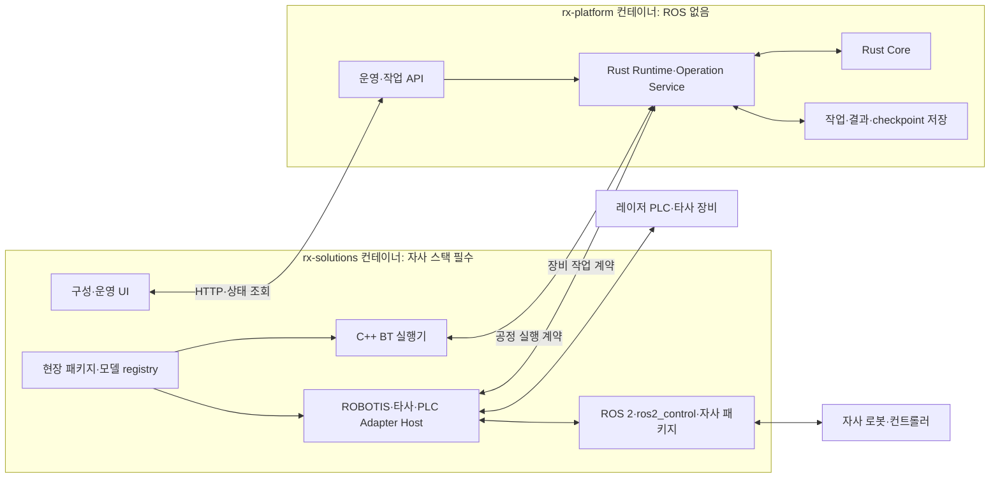

# RX 스택과 레포별 컨테이너 제안

> 2026-09-10 현재 계약의 규범 기준은 [RX 계약·프로토콜 v1.0](contracts/v1.0/README.md)이다. 이 문서의 선행 제안·예시는 v1.0과 충돌하면 대체된다. 자사 기본 지원 의무·두 이미지 경계는 유지하며, 실제 구현·실물 검증은 별도다.

## 1. 이번에 반영하는 전제

**코어 언어는 후속 답변으로 Rust가 선택됐다.** 이를 기준으로 ROS 비의존 코어와 자사 플랫폼을 필수 포함하는 C++·ROS 2 연동/애플리케이션을 구체화한다. 두 레포는 각자의 컨테이너 이미지를 갖는다. 제품의 자사 플랫폼 지원은 필수이며, 그 의존성을 코어 레포까지 전파할 필요는 없다.

이번 전제는 다음과 같다.

- `rx-platform`: 공통 계약·코어·Runtime·작업/실행 기록·복구를 담당하며 ROS 2 의존 저장소를 포함하지 않는 안.
- `rx-solutions`: ROS 2, DynamixelSDK, dynamixel_hardware_interface, open_manipulator, ai_worker, ai_sapiens 및 필요한 전이 의존성을 모두 포함하는 안.
- 레포별 컨테이너의 대상은 위 RX 두 레포다. 자사 원본 저장소마다 별도 컨테이너를 만드는 요구는 아니다.
- 현재 작업은 설계·자료 분석이다. 소스·Dockerfile·Compose·빌드 환경은 아직 생성하거나 실행하지 않는다.

이 문서는 기존 C++ 중심 시작안과 어댑터 레포 배치를 새 전제에 따라 수정한다. 아래 언어 비교는 선택 근거로 보존한다. Rust 선택은 확정됐으나 세부 도구·버전·구현·성능·전체 장비 호환이 검증된 것은 아니다.

## 2. 자사 코드에서 확인한 사실

2026-09-09 로컬 저장소의 package.xml·CMake·의존 목록·컨테이너 정의를 읽었다. 현재 checkout은 모두 main이며 아래 버전은 패키지의 선언값이다. Dockerfile이 가져오는 jazzy branch와 같은 코드라고 가정하지 않는다.[^1]

| 저장소 | 확인된 기반 | 설계에 미치는 영향 |
|---|---|---|
| DynamixelSDK | C/C++·Python 경로, ROS 패키지 4.0.5, C++ 라이브러리 설정 17 | 새 언어로 재작성할 필요 없이 기존 SDK 활용 |
| dynamixel_hardware_interface | 1.5.2, rclcpp·hardware_interface·pluginlib·realtime_tools·SDK·dynamixel_interfaces 의존 | ros2_control에 로드되는 C++ 하드웨어 플러그인 유지 |
| open_manipulator | 5.1.1, C++ 컨트롤러·Python launch, MoveIt·ROS 제어·시뮬레이션 관련 의존 | OMY 등을 위한 모델·실행 구성을 기본 통합 |
| ai_worker | ffw 2.2.5, C++ 제어·Python launch, 이동·팔·gripper·navigation 관련 패키지 | 매니퓰레이터 기능만으로 전체 모델 지원을 표현하지 않음 |
| ai_sapiens | 0.1.2, C++ 제어·sim2real, ONNX Runtime 연결, k1 launch | 자사 휴머노이드 패키지도 기본 의존 집합에 포함 |

기존 open_manipulator·ai_worker·ai_sapiens Docker 정의는 Jazzy를 사용한다. AI Worker의 amd64와 arm64 정의에는 GPU·Jetson·카메라 의존성 차이가 있고, ai_sapiens Dockerfile은 ONNX Runtime 1.23.2를 설치하도록 작성돼 있다. 빌드·부팅·실물 시험을 수행해 확인한 결과는 아니다.[^1]

추가로 `dynamixel_interfaces`, `robotis_interfaces`, `robotis_hand`, 모델별 `cyclo_control`, navigation·카메라·추론 라이브러리 등이 의존 목록에 나타난다. 지정된 다섯 레포만 나열해서 필수 지원 구성이 완성됐다고 볼 수 없다.

## 3. 언어 비교와 선택

비교 기준은 메모리·상태 관리, 기존 C++ 제어 코드 재사용, 언어 간 경계의 비용, 배포·운영, 장기 유지보수다. 정성 평가이며 실제 벤치마크나 팀 숙련도 평가가 아니다.

모든 코어 후보를 동일한 두 컨테이너·C++ solutions 경계에서 비교한다. RPC·직렬화·계약 시험은 C++ 코어를 선택해도 필요한 공통 비용이다. Rust·Go·C#는 기존 C++에 더해 새 언어·도구·운영 역량을 유지하는 비용이 있으며, 이를 특정 후보에만 불리하게 적용하지 않는다.

| 안 | 장점 | 부담·한계 | 이번 판단 |
|---|---|---|---|
| C++ 코어 + C++ ROS 연동 | 기존 제어·BT 생태계와 언어·도구를 공유 | 신규 코어의 메모리·수명·동시성 규율과 검증 부담 | 선택 전 비교한 대안으로 보존 |
| **Rust 코어 + C++ ROS 연동** | 신규 코어의 소유권·상태 타입을 활용하면서 자사 제어 코드 보존 | Rust/Cargo와 C++/colcon을 함께 유지, ownership·async 설계 숙련 필요 | **코어 언어 선택 완료** |
| Rust로 제어 계층까지 통일 | 신규 코드의 언어 일관성 | 기존 C++ 플러그인 재작성 또는 별도 연동 비용 | 자사 자동 지원 요구에 비해 변경이 큼 |
| Python 중심 Runtime | ROS 도구·launch와 빠른 통합, 읽기 쉬운 업무 코드 | 대규모 상태·타입·동시성 규칙의 지속적 규율 필요 | launch·설정·시험·제조사 Python SDK에 사용 |
| Go 또는 C# 코어 | 관리형 메모리의 이점과 서비스·RPC·운영 도구 활용 | 각 런타임·GC의 진단·자원 정책과 C++를 포함한 다언어 유지 | 유효한 대안. 팀 역량·운영 요구에 따라 재평가 |

Rust의 ownership은 컴파일러가 메모리 소유 규칙을 검사하는 방식이다. unsafe 및 외부 라이브러리는 별도 검토가 필요하며, 이것이 작업 논리·안전·실시간 지연을 자동 보장하지는 않는다.[^2] Go의 GC나 .NET의 컨테이너 지원만으로 이 대안들을 부적합하다고 판단하지 않는다. 코어는 고주기 서보 루프가 아니므로 GC 유무만으로 결정할 사안도 아니다.[^9]

Rust가 ROS를 사용할 수 없어서 분리하는 것은 아니다. rclrs는 service·action 등을 제공하지만 현재 README에는 안정성 보장이 없다는 설명과 Jazzy용 추가 빌드 절차가 있다.[^3] 이번 안에서는 Rust가 ROS 노드를 구현할 이유를 줄이고, 기존 C++·ROS 코드를 다른 컨테이너에서 사용한다.

이전 C++ 중심안은 코어·BT·어댑터를 가깝게 조립할 때의 통합 비용을 중시했다. 이제 레포·컨테이너 경계를 유지하면서 자사 제어 코드를 다른 쪽에 모두 둘 수 있으므로, 새 코어의 메모리 안전성과 장기 상태 관리에 비중을 더 두는 것이 타당하다는 판단이다. 선택된 Rust의 개발·장애 대응 역량은 구현·지원 계획에서 확보할 항목으로 남긴다.

## 4. 권고 소프트웨어 스택

| 영역 | 권고 | 배치·이유 |
|---|---|---|
| 순수 코어 | Rust stable, edition 2024 | rx-platform. 상태·식별·조건·결과·복구 규칙. 도메인 코드의 unsafe 사용을 제한 |
| Runtime·API | Rust + Tokio, tonic/Protobuf | rx-platform. 네트워크·작업 조정·이벤트 처리. 코어 도메인과 비동기 I/O 분리 |
| 앱용 API | Rust HTTP/JSON·SSE, Axum 후보 | 권한·명령·기록의 원본은 platform에 두고 UI와 연결[^10] |
| 저장 | SQLite + rusqlite | platform 전용 영속 volume, 단일 writer. DB 처리는 async executor를 막지 않는 별도 경로 |
| 장비·공정 실행 | C++17 기준 + ROS 2 Jazzy + ros2_control + BehaviorTree.CPP | rx-solutions. 기존 제어 플러그인과 BT 활용 |
| 자사 필수 모듈 | 다섯 지정 레포와 전이 의존성·모델 registry | rx-solutions의 기본 빌드·배포·검증 대상 |
| UI | TypeScript + React + Vite 후보 | rx-solutions. 공통 운영 화면과 현장별 구성·확장[^10] |
| launch·도구 | Python 3.12 계열 | Jazzy 환경의 기존 launch·도구·필요한 SDK 활용 |
| ROS 통신 | rmw_zenoh_cpp 우선 검토 | 자사 기존 컨테이너 설정과 대조. domain·namespace·router·RMW를 명시적으로 고정 |
| 빌드 | platform: Cargo / solutions: colcon·ament·CMake 및 UI 빌드 | 원본 저장소의 요구를 존중하고 하나의 언어 표준을 전역 강제하지 않음 |
| 컨테이너 | Docker/OCI 이미지 각 1종을 기본, Compose로 조합 | OS·CPU/GPU별 지원 variant는 같은 레포에서 관리 |
| 이미지 기준 OS | Ubuntu 24.04 userland | platform은 ROS 없는 이미지, solutions는 Jazzy 기반. 실제 호스트·GPU 드라이버 조건은 별도 명세 |

tonic 조회 시 문서는 0.14.6이며, 저장소 master에는 breaking changes 준비 안내가 있다. 안정 릴리스와 생성기·Protobuf 버전을 함께 고정하고 master를 그대로 따라가지 않는다.[^4] 그 외 라이브러리도 설계 기준판에서 정확한 버전·라이선스·지원 CPU를 고정한다. 현재의 후보 표는 완성된 lockfile이 아니다.

ROS Jazzy의 Ubuntu binary 대상은 24.04이고, 공식 배포 목록상 지원 종료는 2029년 5월이다. Lyrical은 2026년에 출시돼 2031년 5월까지로 기재돼 있지만, 이번 기준은 자사 기존 Jazzy 구성을 우선한다. 더 최신이라는 이유로 필수 스택 전체를 먼저 이식하지 않는다.[^5]

ROS 2 기본 RMW와 자사 Docker 설정은 같지 않을 수 있다. 기존 파일에 rmw_zenoh_cpp가 설치·설정돼 있다는 사실만으로 모든 비대화형 서비스가 같은 RMW로 실행됐다고 확정하지 않는다. 실행 환경·라우터 설정을 프로파일과 컨테이너 서비스 명세에서 확인해야 한다.[^1]

## 5. 두 컨테이너의 역할

컨테이너 기본 인스턴스는 두 개지만 내부 프로세스가 하나씩이어야 하는 것은 아니다. Runtime과 BT·장비 Host·ROS controller는 역할에 맞게 별도 프로세스로 둘 수 있다. Docker 문서도 여러 프로세스를 허용하지만 관리·종료 책임을 명확히 하도록 설명한다.[^6] 기존 s6 사용 경험을 참고해 시작 순서·상태·종료·개별 재기동을 설계하며, UI의 생존만으로 장비 제어가 준비됐다고 판단하지 않는다.

**하드웨어 자원은 solutions 쪽에서만 소유한다.** 같은 serial 장치나 로봇을 기존 컨테이너와 RX가 동시에 제어하지 않도록 한다. 이미 장비 측 제어기가 구동 중인 구성은 그 제어기의 상위 인터페이스로 연결한다. SDK·hardware_interface 라이브러리를 별도 RPC 서비스로 쪼개지 않고, controller_manager가 요구하는 플러그인 경계와 제어 루프를 유지한다.

정의·검증된 현장 패키지는 solutions에서 제공하고 platform에 배포 명세·해시·관련 정책을 등록한다. platform은 실행 시 사용한 버전과 작업 결과를 영속 보존한다. solutions가 별도의 ‘진짜 작업 상태’ 원장을 만들어 서로 다른 완료를 판정하지 않는다.

고주기 관절 제어는 solutions의 적합한 제어기·장비 루프에서 수행한다. 두 컨테이너 사이에는 장비 작업·상태·결과 계약을 교환한다. 장비 command가 이미 전달됐을 수 있는 시점에는 gRPC 취소나 연결 종료를 물리 중단으로 해석하지 않는다.

## 6. BT가 다른 레포에 있을 때의 실행 흐름

1. UI가 공정·패키지 버전으로 platform에 실행을 요청한다.
2. platform이 작업지시·공정 실행 ID와 허용 조건을 기록하고, solutions의 실행기에 명시적 실행 권한을 제공한다.
3. BT는 해당 실행의 다음 장비 작업을 platform에 요청한다.
4. platform은 요청 동일성·조건·자원을 판정한 뒤 solutions의 지정 Adapter에 전달한다.
5. Adapter가 관측·결과를 반환하면 platform이 이를 기록하고 BT·UI에 통지한다.

소스 의존 방향은 `rx-solutions → rx-platform의 공개 계약`이다. 런타임 메시지는 양방향일 수 있다. platform은 ROS·BT 구현을 import하지 않고 일반 `WorkflowExecutorPort`·`DevicePort` 계약으로 연결한다. 재진입 RPC가 서로 기다리지 않도록 접수와 장기 실행을 분리하고 상태 스트림으로 진행을 통지한다.

이 안은 BT 경계가 추가된다는 비용이 있다. 공정 실행 ID·단계 활성화·operation ID·checkpoint를 계약으로 정해야 한다. BT의 메모리나 FAILURE만으로 복구·재실행을 결정하지 않으며, 재시작·잔류 명령 처리는 platform의 기록과 장비 근거를 대조한다.

단계 활성화와 operation ID의 연결은 최초 장비 전달 전에 platform에 기록한다. BT만 재시작해도 새 활성화를 임의로 만들지 않고, 기존 run·활성화·operation ID와 checkpoint·이미 기록된 결과를 복원한 뒤 다음 단계로 진행한다. 이 규칙은 코어 언어가 무엇이든 동일하게 적용한다.

## 7. ‘자사 플랫폼 자동 지원’의 제품 의미

자사 다섯 레포는 선택 설치 대상이 아니다. solutions의 필수 의존 목록·기본 모델 목록·공통 API 연결·빌드/계약/실물 검증 계획에 포함한다. 새 고객 현장마다 그 드라이버를 다시 구현하거나 별도 설치하도록 요구하지 않는 것이 목표다.

| 단계 | 자동 제공할 것 | 확인이 필요한 것 |
|---|---|---|
| 빌드·배포 | 모든 지정 자사 패키지와 전이 의존성, 버전 목록 | 동일 dependency 조합의 빌드·라이선스·CPU 적합성 |
| 모델 등록 | OMY/open_manipulator, FFW/AI Worker, AI Sapiens의 기본 모델·기능 registry | 세부 모델·tool·controller·firmware 대응 |
| 장비 연결 | 지원 모델의 어댑터 선택·상태·버전 진단 | 실제 장비 식별·주소·namespace·제어권 |
| 작업 준비 | 프로파일과 기능 요구 대조, 부족 조건 표시 | 교정·gripper·현장 조건·운전 범위 |
| 작업 실행 | 공통 API로 요청·관측·결과 연결 | 허가된 작업과 실제 완료·중단 근거 |

자동 지원은 모든 로봇의 동시 기동·토크 인가·자동 이동을 뜻하지 않는다. 기본 패키지를 탑재하고 등록해도 실제 장비별 실행 조건은 확인한다. 자사 이동체·휴머노이드의 연결·설정·진단과 해당 제어 기능은 기본 통합 범위에 넣고, 새로운 현장 공정 전체를 자동 생성하는 능력은 별도 요구로 다룬다.

한 가지 장비의 시험만으로 다섯 레포의 자동 지원 완료를 선언하지 않는다. 각 제품군의 필수 기능·세부 모델·CPU/GPU 조합에 대한 지원표와 시험 증거가 필요하다. 현재는 이 지원을 반드시 구축해야 한다는 요구가 확정된 것이며, 구현 완료 상태는 아니다.

필수 자사 모듈이 누락되거나 선언할 필수 기능의 적합성 검증이 실패한 이미지를 그 지원 범위의 표준 제품으로 출시하지 않는다. 첫 시연의 범위와 제품 전체 기본 지원의 검증 범위는 구분해 기록한다.

## 8. 의존성과 이미지 관리

하나의 solutions 빌드에서 같은 ROS package를 여러 원본 경로로 중복 포함하지 않는다. DynamixelSDK→hardware interface→로봇 패키지의 공통 의존성을 한 집합으로 정리한다. `.repos`의 main과 Dockerfile의 jazzy clone, 서로 다른 SDK·추론·카메라 버전을 합친 뒤 그대로 동작한다고 가정하지 않는다.

자사 원본 레포의 commit, ROS 패키지 버전, apt/pip/Cargo/UI 의존성, 기반 이미지 digest, 아키텍처·드라이버 요구를 묶어 기록한다. upstream 변경은 자동 설치가 아니라 검증된 지원 조합의 업데이트로 반영한다. ai_sapiens의 ONNX 탐색과 AI Worker arm64의 Jetson 의존성처럼 package.xml만으로 닫히지 않는 의존성도 포함한다.

기본 설치에서는 모든 자사 지원 모듈을 포함한다. CPU/GPU·보드별 이미지는 하드웨어에 맞는 의존성을 제공하기 위한 variant이며, 자사 제품을 임의의 유료/선택 플러그인으로 제외하는 구분이 아니다. 해당 모델의 필수 기능이 특정 보드를 요구하면 지원표·장비 준비 조건에서 명시한다.

기존 Compose의 privileged·전체 /dev·host network 설정은 관측된 개발 구성이다. 최종 제품에서는 필요한 장치·그룹·권한·네트워크·실시간 스케줄링 조건을 모델별로 설계한다. 컨테이너만으로 호스트 커널·드라이버·실시간성이 해결되지 않으며, Docker Desktop의 장치 경로와 native Linux 현장 실행도 구분한다.[^7][^8]

## 9. 이번에 더 정할 설계 산출물

다음 상세화는 코드가 아니라 세 문서다.

1. **자사 기본 지원표 우선:** 제품군·모델, driver/controller, 상위 작업·관측, 교정·모드·필수 전이 의존성, 검증 범위. [13 명세](13_robotis_support_matrix.md).
2. **지원표에서 두 이미지 명세 도출:** 포함 패키지, 실행 프로세스, volume, 장치·네트워크 권한, CPU/GPU variant, 종료·재시작 정책. [14 명세](14_image_support_spec.md).
3. **세 계약:** UI/운영 API, 공정 실행기 계약, 장비 작업 계약. ID·세대·중단·불명·재시작 규칙을 연결.

Rust와 C++의 정확한 toolchain, gRPC 생성기, ROS·RMW·하드웨어 의존 버전은 이 설계 명세에서 고정한다. 지금 Dockerfile·Compose나 제품 코드를 작성하지 않는다.

## Sources

[^1]: [자사 저장소 읽기 전용 조사](/Users/ojaehong/RX_automation/rx_ws/references/stack_research_2026-09-09.md), [HEAD·package 의존성·파일 해시](/Users/ojaehong/RX_automation/rx_ws/references/stack_local_inventory_2026-09-09.json). 2026-09-09 확인. 빌드·실물 검증 미수행.
[^2]: Rust Project, [Ownership](https://doc.rust-lang.org/book/ch04-01-what-is-ownership.html), [Unsafe Rust](https://doc.rust-lang.org/book/ch20-01-unsafe-rust.html). 메모리 관리 방식·보장 범위. 2026-09-09 확인.
[^3]: ros2-rust, [ros2_rust README](https://github.com/ros2-rust/ros2_rust), 기능·안정성 설명·Jazzy 설치 범위. 2026-09-09 확인. ROS 불가라는 근거로 사용하지 않음.
[^4]: gRPC Rust, [tonic 0.14.6](https://docs.rs/tonic/0.14.6/tonic/), [저장소와 breaking-change 안내](https://github.com/grpc/grpc-rust); [Tokio](https://docs.rs/tokio/latest/tokio/), [rusqlite](https://docs.rs/rusqlite/latest/rusqlite/). 2026-09-09 확인. 라이브러리 선택·운영 구성은 본 문서의 제안.
[^5]: ROS 2 공식 문서 원본, [배포·지원 종료 목록](https://github.com/ros2/ros2_documentation/blob/rolling/source/Releases.rst), [Jazzy Ubuntu 설치 대상](https://github.com/ros2/ros2_documentation/blob/jazzy/source/Installation/Ubuntu-Install-Debs.rst). 2026-09-09 확인. docs.ros.org 열람 제한 때문에 공개된 공식 원본을 사용.
[^6]: Docker, [컨테이너의 여러 프로세스](https://docs.docker.com/engine/containers/multi-service_container/). 2026-09-09 확인. 정확히 두 컨테이너의 배치·고장 범위는 RX 설계 판단.
[^7]: Docker, [USB/IP와 Docker Desktop](https://docs.docker.com/desktop/features/usbip/), [플랫폼별 이미지](https://docs.docker.com/build/building/multi-platform/). 2026-09-09 확인.
[^8]: Docker, [자원과 실시간 스케줄러 조건](https://docs.docker.com/engine/containers/resource_constraints/). 2026-09-09 확인. 실제 요구 지연·장치·커널 조건의 만족은 별도 시험 필요.
[^9]: Go Project, [GC guide](https://go.dev/doc/gc-guide); Microsoft, [.NET와 Docker](https://learn.microsoft.com/en-us/dotnet/core/docker/introduction). 후보의 기술적 가능성 참고. 2026-09-09 확인.
[^10]: [Axum](https://docs.rs/axum/latest/axum/), [React](https://react.dev/learn), [Vite](https://vite.dev/guide/). 공식 라이브러리·프로젝트 문서, 2026-09-09 확인. 조합 선택은 RX 제안이며 아직 빌드하지 않음.
