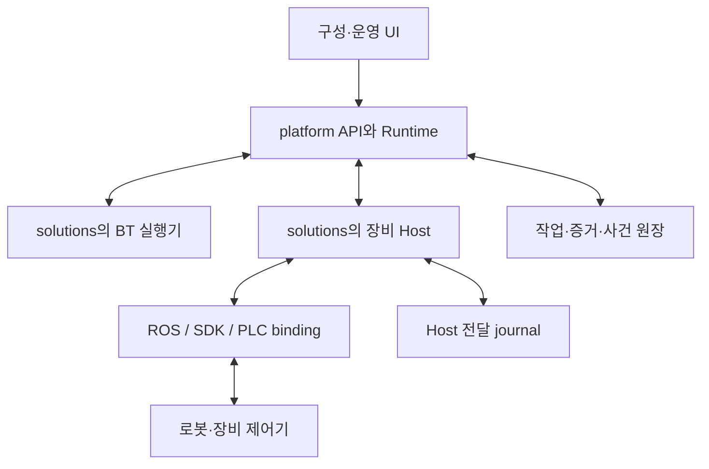

# 책임 경계와 작업 의미

규범: RX 계약 v1.0 · [기준판](README.md)

## 1. 책임 지도

| 경계 | 요청·제공 주체 | 결정/기록 권위 | 책임과 제한 |
|---|---|---|---|
| C01 | 운영 UI/외부 업무 client ↔ platform API | platform | 구성 revision, 허가, run 시작·중단·복구 요청을 기록한다. UI는 표시와 요청을 맡으며 로컬 success 표시로 작업 결과를 만들지 않는다. |
| C02 | platform ↔ workflow/BT executor | run·activation·checkpoint는 platform | executor는 다음 단계와 분기를 제안한다. platform이 해당 activation의 자식 operation을 유일하게 할당한다. BT 재tick이 새 물리 동작을 뜻하지 않는다. |
| C03 | platform ↔ Device Host/Adapter | 작업 의도·결론은 platform, native 전달 사실은 Host | Host는 능력·현재 조건을 검사하고 native 변환·관측을 수행한다. platform 결과를 스스로 덮어쓰지 않는다. |
| C04 | Host/Runtime 사건 → platform → 소비자 | 원본 관측은 생성자, 수용·결론·사건 원장은 platform | 관측과 판단은 별도 레코드다. 소비자가 기록 cursor와 telemetry를 혼동하지 않는다. |
| C05 | platform ↔ executor/Host의 제어권·수명주기 | 논리 권한은 platform, 물리 전달 fence는 Host | lease·세대·충돌 자원·기동/종료 조건을 적용한다. 외부 수동 조작은 별도 장비 상태로 관측한다. |
| C06 | 서명된 release/profile ↔ admission | platform 검증 + Host 현 상태 확인 | 포함 패키지, 모델, 펌웨어, 교정, 모드, 관측, 중단 정책을 대조한다. 파일 설치만으로 실행을 허가하지 않는다. |
| C07 | Runtime ↔ 영속 저장 | platform의 단일 writer | 요청 동일성·작업·checkpoint·사건·outbox를 transaction 경계에 맞춰 저장한다. 내부 port이며 네트워크 API일 필요가 없다. |
| C08 | Adapter ↔ ROS/SDK/PLC/부속 제어기 | 실제 장비 상태의 원천은 장비 | native 접수·관측의 의미를 보존한다. 숨은 재시도·모드 전환·토크 효과를 profile에 명시한다. |

물리 허용 조건은 검사 직후에도 바뀔 수 있다. platform의 admission은 장비의 interlock을 대체하지 않는다. Host는 전달 직전 다시 확인하고, 동작 중 필요한 즉시 반응은 장비 측 제어와 별도 안전 기능이 담당한다.

## 2. 객체 계층

`Release → SiteConfiguration → Run → Activation → Operation → NativeInvocation`을 구별한다.

- Release는 계약 schema·소프트웨어·profile·recipe·tool 정보를 묶은 불변 버전이다.
- SiteConfiguration은 장비 instance·통신 endpoint·교정·작업자 정책을 특정 release에 결합한다.
- Run은 특정 품목·recipe·소재 흐름을 수행하는 회차다. 주문/lot 등 공정관리 ID는 상위 상관관계이며 장비 operation ID를 대신하지 않는다.
- Activation은 run 안의 특정 단계의 특정 방문이다. 반복문의 다음 방문은 새로운 activation이다.
- Operation은 한 Host의 한 native 효과를 요청하거나 한 목표 상태/세션을 관리하는 단위다. v1에서 임의의 여러 native 명령을 숨겨 넣는 composite operation은 금지한다. 공정 복합 동작은 여러 activation/operation으로 구성한다.
- NativeInvocation은 SDK/action/PLC 요청과 연결된 전달 기록이다. 장비가 native ID를 제공하지 않으면 ‘없음’과 correlation 한계를 명시한다.

‘native 생산 요청 최대 한 번’은 유한 동작·상태 쓰기·모드/기동 전이의 **production invocation**에 적용한다. 원 작업을 중단하는 cancel invocation은 별도 cancel_id, 제어 sample은 control session+source_seq, 현지 보호 반응은 protection incident 단위다. 이들을 같은 invocation counter에 합치지 않는다.

## 3. 작업 종류와 완료 조건

| 종류 | 입력 | 성공의 의미 | 재시작·반복의 규칙 |
|---|---|---|---|
| FINITE_ACTION | 검증된 trajectory/program artifact와 매개변수 | 이번 native invocation과 연결된 종료 결과 + profile의 후조건 | 현재 idle만으로 과거 성공을 추론하지 않는다. 불명 뒤 같은 동작 자동 재실행 금지. |
| ENSURE_STATE | 명명된 predicate와 목표값 | 신선하고 유효한 관측으로 목표 predicate가 성립함 | 이미 성립하면 native 쓰기 없이 성공 가능. 쓰기를 했다면 일반 전달 journal 적용. 성공은 ‘현재 상태 확보’이지 그 쓰기가 원인이라는 주장 아님. |
| MODE_TRANSITION | 목표 mode ID, profile | 목표 모드 활성 관측 및 profile에 명시된 전이 조건 | service success만으로 자세 도달을 선언하지 않는다. 모드 변경에 움직임이 포함되면 lifecycle과 동일하게 부작용 명시. |
| CONTROL_SESSION | source, command schema, 제어 profile, 종료 정책 | 세션의 개방·종료 결과를 관리. sample마다 유한 작업을 만들지 않음 | 세션의 OPEN은 생산 작업 완료가 아니다. 만료/재시작 후 기존 sample 재생 금지. |
| LIFECYCLE_TRANSITION | prepare/activate/deactivate/shutdown 및 목표 준비 수준 | 드라이버 상태와 토크·자세·지지 등 profile 후조건 | ROS lifecycle 이름과 실제 부작용은 다를 수 있다. destructor를 안전한 무효 연산으로 간주하지 않는다. |

읽기 전용 `Observe/Get`는 작업을 새로 만들지 않는다. 읽기라고 표시된 native API가 초기화·토크·모드 효과를 가진다면 이 분류를 쓸 수 없다.

CONTROL_SESSION operation은 OPEN 동안 ACTIVE/outcome=NONE이다. 요청에 의한 정상 종료와 profile 종료 후조건을 확인하면 SUCCEEDED, 장애 만료 후 확인된 종료는 FAILED와 종료 이유, 결과를 확인할 수 없으면 RECONCILING/UNKNOWN이다. CANCELED는 명시 cancel 요청으로 종료된 경우에 사용한다. 어느 경우에도 세션 자체의 SUCCEEDED를 소재 공급 작업 성공으로 해석하지 않는다.

## 4. 접수 단계

| 단계 | 뜻 | 보장하지 않는 것 |
|---|---|---|
| ADMITTED | platform이 식별·의도·활성화 연결·전달 대기를 durable commit했다 | Host 수신·장비 실행 |
| HOST_PREPARED | Host가 동일성·profile·자원 조건을 확인하고 inbox에 기록했다 | native 호출 여부 |
| SEND_ENTERED | Host가 ‘이후 native 효과가 발생할 수 있음’을 durable 기록했다 | 실제 호출 성공·장비 접수 |
| NATIVE_ACCEPTED | native API가 profile에 정의된 의미의 접수를 보고했다 | 물리 완료·원장 저장 |
| RESULT_RECORDED | platform이 근거와 결과를 같은 transaction으로 기록했다 | 현재도 그 물리 상태가 유지됨·자원 해제 가능 |

SDK return code의 의미가 단순 전송 성공이면 NATIVE_ACCEPTED 대신 `TRANSPORT_RETURN` 증거만 남긴다. 접수 단계는 생략될 수 있다. 예를 들어 ENSURE_STATE가 이미 만족되면 native 접수 없이 끝난다.

## 5. 상태와 지식의 분리

Operation은 아래 독립 축을 가진다. 하나의 `RUNNING/UNKNOWN` enum으로 덮어쓰지 않는다.

| 축 | 값 | 의미 |
|---|---|---|
| phase | ADMITTED, ACTIVE, RECONCILING, SETTLED | RX가 관리하는 처리 단계 |
| execution_knowledge | NOT_SENT, MAY_HAVE_EXECUTED, ACCEPTED, RUNNING, ENDED, UNKNOWN | 최신 유효 근거로 알 수 있는 native 실행 상태 |
| outcome | NONE, SUCCEEDED, FAILED, CANCELED, NOT_EXECUTED, UNRESOLVED | 기록된 작업 결과. NONE 외에는 SETTLED와 함께 기록 |
| integrity | VALID, DISPUTED | 기록된 결론의 근거에 충돌이 발견됐는지 |
| resource_disposition | HELD, QUARANTINED, RELEASED | 다음 작업에 명령 자원을 넘길 수 있는지 |

`UNKNOWN`은 장비가 멈췄다는 뜻이 아니다. RUNNING을 새로 관측해도 과거 유실한 완료 결과가 복원된 것은 아니다. **UNKNOWN과 RUNNING 사이의 갱신 자체를 결과로 사용해서는 안 된다.**

| 현재 | 사건·guard | 다음 상태·결과 |
|---|---|---|
| ADMITTED/NOT_SENT | Host가 SEND_ENTERED를 기록했거나 전달 여부를 확인할 수 없음 | ACTIVE/MAY_HAVE_EXECUTED 또는 RECONCILING/UNKNOWN |
| ADMITTED | platform outbox 미발행을 확정하거나 Host가 PREPARED를 폐기한 기록을 확인 | SETTLED/NOT_EXECUTED 가능 |
| ACTIVE | 해당 invocation의 진행 근거 | ACTIVE/ACCEPTED 또는 RUNNING |
| ADMITTED/ACTIVE | native 무호출 목표 충족 또는 유효한 성공 근거 집합 | SETTLED/SUCCEEDED |
| ACTIVE | profile이 허용한 확정 실패 결과 | SETTLED/FAILED. 물리 잔류 효과는 별도 유지 |
| ADMITTED/ACTIVE/RECONCILING | timeout·연결 유실·장비 세대 의심·증거 부족 | RECONCILING/UNKNOWN. cancel 요청은 별도 기록 |
| ACTIVE/RECONCILING | 해당 작업이 중단됐다는 근거와 종료 조건 | SETTLED/CANCELED |
| RECONCILING | 상관관계가 보존된 종료 근거를 회수 | SETTLED/해당 outcome |
| RECONCILING | 조사 후 결과를 더 알 수 없고 운영 책임자가 포기 처분 | SETTLED/UNRESOLVED. 성공 분기 금지, 자원 격리 유지 |
| SETTLED | 기존 근거와 양립 불가능한 후발 증거 | outcome 보존, integrity=DISPUTED, 영향 자원·run 격리 |

SETTLED outcome은 다른 outcome으로 조용히 수정하지 않는다. 정정은 기존 결론을 참조하는 별도 조사·처분 기록이다. UI는 DISPUTED 결과를 정상 성공으로 표시하지 않으며 그 결과를 선행 조건에 사용할 수 없다. 장비 재시작으로 현재 상태가 무효화되는 것은 과거 완료 기록과의 모순 자체는 아니다.

## 6. 증거와 판정 규칙

Observation에는 `observation_id, source_id, receive_boot_id, receive_time, quality, value_schema, value, correlation, freshness_basis`가 필수다. `source_boot_evidence, sample_seq, source_time, uncertainty_ms`의 presence는 03 메시지 표를 따른다. 없는 원본 boot/seq를 가짜 0/현재 process ID로 채우지 않는다. boot/seq 부재를 profile에 표시하고, 원본 취득 age 상한을 증명할 수 있는 READ_TRANSACTION/PACKET_RECEIPT만 해당 조건에서 허용한다. 상한도 모르면 CACHED_UNKNOWN이며 현재 상태 완료 근거로 사용할 수 없다. callback 호출 시각이나 캐시 조회 시각을 원본 sample 시각으로 꾸미지 않는다.

Evidence는 특정 observation/native result/operator attestation의 불변 레코드다. profile의 `completion_rule`이 필요한 증거 종류·상관관계·오차·유효 시간·모순 판정을 지정한다. platform은 해당 규칙을 평가하고 그 입력 evidence를 결과와 함께 저장한다. 가변 메모리의 최신 값 링크만 저장하지 않는다.

- `quality=GOOD`만으로 충분하지 않다. 해당 device generation, 값 종류, freshness, correlation, mode, calibration revision이 맞아야 한다.
- 고정 신뢰도 0–1 숫자를 모든 센서에 강제하지 않는다. 추정 모델에만 confidence와 그 의미/threshold를 schema에 둔다. 물리 접점은 상태·통신 품질·진단·신선도로 표현할 수 있다.
- 사람 확인은 `HUMAN_ATTESTATION`이며 actor·범위·관측 시점·절차 revision을 남긴다. 일반적인 ‘확인’ 버튼으로 native 성공 증거를 생성하지 않는다.
- 완료 증거가 없는 장비에 시간 경과만으로 성공을 선언하는 profile은 허용하지 않는다. 시간은 지연·최대 대기·정착 구간으로 쓸 수 있으나 필요한 상태 근거를 대신하지 않는다.

## 7. 취소·정지·자원 인계

취소 요청의 접수는 취소 완료와 다르다. `RequestCancel`은 intent를 기록하고 Host의 profile별 정지/취소 경로를 요청한다. 이미 성공한 작업에는 성공 결과와 `ALREADY_SETTLED`를 반환한다. cancel과 success가 경합하면 도착 순서가 아니라 해당 native invocation의 결과와 후조건으로 판정한다. 양립 불가능하면 DISPUTED다.

`RELEASED`에는 (a) 잔류 native 명령이 더 실행되지 않음, (b) 다음 소유자가 사용할 수 있는 제어 상태, (c) 필요한 소재·중력 지지 인계가 확인돼야 한다. 장비 완료·토크 off·lease 만료 중 어느 하나만으로 자동 해제하지 않는다.

UNRESOLVED 작업의 자원은 검증된 복구 절차로 현재 상태·잔류 명령·제어권을 확보한 후 새 `RecoveryDisposition`으로 해제할 수 있다. 이때도 과거 작업 성공으로 바꾸지 않는다. 다음 생산은 새 activation이며 기존 소재 상태를 다시 정해야 한다.

## 8. 필수 불변식

- I01: 일반 native 효과에는 선행 platform intent commit과 Host SEND_ENTERED commit이 있다.
- I02: 동일 scope/key는 하나의 불변 의도와 하나의 operation에만 연결된다.
- I03: SEND_ENTERED 이후 결과 불명은 자동 native 재전송의 근거가 되지 않는다.
- I04: SUCCEEDED는 지정된 증거 규칙을 만족하며 timeout/idle/BT success만으로 생성되지 않는다.
- I05: 동일 충돌 자원에 동시에 유효한 RX command owner는 최대 하나다.
- I06: 재시작·만료된 제어 세션의 sample은 다시 실행되지 않는다.
- I07: 판단에 사용한 근거·결과·사건·revision은 원자적으로 기록된다.
- I08: result terminal과 resource release는 별도 조건이다.
- I09: 갭·재부팅·시간 불확실성을 숨겨 GOOD/fresh로 만들지 않는다.
- I10: 지원 패키지 포함과 특정 현장 작업 admission은 구별한다.
- I11: UI·BT·Native return이 플랫폼 결론 원장을 우회해 성공을 확정하지 않는다.
- I12: 저장 불능에서도 미리 정한 현지 보호 반응은 DB commit을 기다리지 않는다. 이 예외가 일반 생산 명령을 허용하지 않는다.
