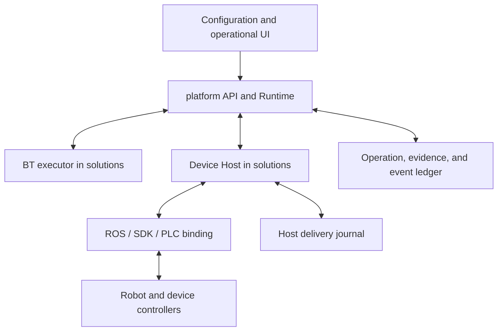

# Responsibility Boundaries and Operation Semantics

Normative: RX Contract v1.0 · [Baseline](README.md)

## 1. Responsibility map

| Boundary | Requesting/providing parties | Decision/record authority | Responsibilities and limits |
|---|---|---|---|
| C01 | Operational UI/external business client ↔ platform API | platform | Records configuration revisions, authorization, and run start/pause/recovery requests. The UI displays information and submits requests; a local success indication does not create an operation outcome. |
| C02 | platform ↔ workflow/BT executor | platform owns runs, activations, and checkpoints | The executor proposes subsequent steps and branches. The platform uniquely allocates child operations for each activation. A BT retick does not mean a new physical action. |
| C03 | platform ↔ Device Host/Adapter | platform owns operation intent/conclusions; Host owns native delivery facts | The Host checks capabilities/current conditions and performs native translation and observation. It does not independently overwrite platform outcomes. |
| C04 | Host/Runtime events → platform → consumers | Producer owns original observations; platform owns acceptance, conclusions, and the event ledger | Observations and decisions are separate records. Consumers must distinguish record cursors from telemetry. |
| C05 | platform ↔ executor/Host authority and lifecycle | platform owns logical authority; Host owns physical delivery fencing | Applies leases, generations, conflicting resources, and startup/shutdown conditions. External manual intervention is observed as separate device state. |
| C06 | Signed release/profile ↔ admission | platform verification + Host current-state checks | Compares included packages, models, firmware, calibration, modes, observations, and cancellation policies. Installing files alone does not authorize execution. |
| C07 | Runtime ↔ persistent storage | platform's single writer | Stores request identity, operations, checkpoints, events, and outbox records according to transaction boundaries. This is an internal port and need not be a network API. |
| C08 | Adapter ↔ ROS/SDK/PLC/auxiliary controllers | Device is the source of actual device state | Preserves the meaning of native acceptance and observations. Profiles specify hidden retries, mode changes, and torque effects. |

Physical permissive conditions can change immediately after a check. Platform admission does not replace device interlocks. The Host checks again immediately before dispatch; device-side control and separate safety functions handle immediate reactions required during operation.

## 2. Object hierarchy

Distinguish `Release → SiteConfiguration → Run → Activation → Operation → NativeInvocation`.

- A Release is an immutable version that bundles contract schemas, software, profiles, recipes, and tool information.
- A SiteConfiguration binds device instances, communication endpoints, calibration, and operator policies to a specific release.
- A Run is one execution of a particular item, recipe, and material flow. Process-management IDs such as orders/lots provide higher-level correlation; they do not replace device operation IDs.
- An Activation is a particular visit to a particular step within a run. The next visit in a loop is a new activation.
- An Operation requests one native effect from one Host or manages one target state/session. v1 prohibits composite operations that hide arbitrary multiple native commands. Composite process actions consist of multiple activations/operations.
- A NativeInvocation is a delivery record linked to an SDK/action/PLC request. If the device provides no native ID, explicitly record its absence and the correlation limitations.

“At most one native production request” applies to the **production invocation** of finite actions, state writes, and mode/startup transitions. A cancel invocation that interrupts the original operation has a separate cancel_id; control samples use control session+source_seq; local protective reactions use protection incidents. Do not combine them into the same invocation counter.

## 3. Operation kinds and completion conditions

| Kind | Input | Meaning of success | Restart/repetition rules |
|---|---|---|---|
| FINITE_ACTION | Validated trajectory/program artifact and parameters | Terminal result correlated with this native invocation + profile postconditions | Current idle state does not establish past success. Do not automatically re-execute the same action after an unknown outcome. |
| ENSURE_STATE | Named predicate and target value | Fresh, valid observations establish the target predicate | May succeed without a native write if already satisfied. If a write occurs, the normal delivery journal applies. Success means “the current state is established,” not that this write caused it. |
| MODE_TRANSITION | Target mode ID and profile | Observation that the target mode is active and the transition conditions specified in the profile | Service success alone does not establish pose attainment. If a mode change includes motion, specify side effects as for lifecycle transitions. |
| CONTROL_SESSION | Source, command schema, control profile, and closure policy | Manages session opening/closure outcomes. Does not create a finite operation per sample | Session OPEN does not mean production completion. Do not replay existing samples after expiry/restart. |
| LIFECYCLE_TRANSITION | prepare/activate/deactivate/shutdown and target readiness level | Driver state and profile postconditions such as torque, pose, and support | ROS lifecycle names may differ from actual side effects. Do not treat a destructor as a safe no-op. |

Read-only `Observe/Get` does not create an operation. A native API labeled as a read cannot use this classification if it has initialization, torque, or mode effects.

A CONTROL_SESSION operation remains ACTIVE/outcome=NONE while OPEN. Confirmed normal closure on request and profile closure postconditions produce SUCCEEDED; confirmed closure after fault expiry produces FAILED with the closure reason; an unconfirmable outcome produces RECONCILING/UNKNOWN. CANCELED is used for closure by an explicit cancel request. In no case does the session's own SUCCEEDED mean that a material-feeding operation succeeded.

## 4. Acceptance stages

| Stage | Meaning | Does not guarantee |
|---|---|---|
| ADMITTED | The platform durably committed identity, intent, activation binding, and pending dispatch | Host receipt or device execution |
| HOST_PREPARED | The Host checked identity/profile/resource conditions and recorded the request in its inbox | Whether a native call occurred |
| SEND_ENTERED | The Host durably recorded that “a native effect may occur from this point” | Actual call success or device acceptance |
| NATIVE_ACCEPTED | The native API reported acceptance with the meaning defined by the profile | Physical completion or ledger persistence |
| RESULT_RECORDED | The platform recorded evidence and outcome in the same transaction | That the physical state still holds or that resources can be released |

If an SDK return code means only successful transmission, record only `TRANSPORT_RETURN` evidence instead of NATIVE_ACCEPTED. Acceptance stages may be skipped. For example, an already-satisfied ENSURE_STATE finishes without native acceptance.

## 5. Separating state and knowledge

An Operation has the following independent axes. Do not collapse them into a single `RUNNING/UNKNOWN` enum.

| Axis | Values | Meaning |
|---|---|---|
| phase | ADMITTED, ACTIVE, RECONCILING, SETTLED | Processing stage managed by RX |
| execution_knowledge | NOT_SENT, MAY_HAVE_EXECUTED, ACCEPTED, RUNNING, ENDED, UNKNOWN | Native execution state knowable from the latest valid evidence |
| outcome | NONE, SUCCEEDED, FAILED, CANCELED, NOT_EXECUTED, UNRESOLVED | Recorded operation outcome. Every value other than NONE is recorded together with SETTLED |
| integrity | VALID, DISPUTED | Whether conflicting evidence for a recorded conclusion has been discovered |
| resource_disposition | HELD, QUARANTINED, RELEASED | Whether command resources can be handed to the next operation |

`UNKNOWN` does not mean the device has stopped. A new RUNNING observation does not restore a previously lost completion result. **An update between UNKNOWN and RUNNING must not itself be used as an outcome.**

| Current state | Event/guard | Next state/outcome |
|---|---|---|
| ADMITTED/NOT_SENT | Host recorded SEND_ENTERED, or delivery cannot be confirmed | ACTIVE/MAY_HAVE_EXECUTED or RECONCILING/UNKNOWN |
| ADMITTED | Confirmed non-emission of platform outbox, or confirmed Host record voiding PREPARED | SETTLED/NOT_EXECUTED is possible |
| ACTIVE | Progress evidence for this invocation | ACTIVE/ACCEPTED or RUNNING |
| ADMITTED/ACTIVE | Target satisfied without a native call, or valid set of success evidence | SETTLED/SUCCEEDED |
| ACTIVE | Definitive failure result permitted by the profile | SETTLED/FAILED. Residual physical effects remain tracked separately |
| ADMITTED/ACTIVE/RECONCILING | Timeout, connection loss, suspected device generation change, or insufficient evidence | RECONCILING/UNKNOWN. Cancel requests are recorded separately |
| ACTIVE/RECONCILING | Evidence that this operation was interrupted and its closure conditions hold | SETTLED/CANCELED |
| RECONCILING | Recovered terminal evidence with preserved correlation | SETTLED/corresponding outcome |
| RECONCILING | Investigation cannot determine more about the outcome and the responsible operator records abandonment | SETTLED/UNRESOLVED. Success branching prohibited; resource quarantine retained |
| SETTLED | Late evidence incompatible with the existing evidence | Preserve outcome, set integrity=DISPUTED, quarantine affected resources/runs |

A SETTLED outcome is not silently changed to another outcome. A correction is a separate investigation/disposition record referencing the original conclusion. The UI must not display DISPUTED results as normal success, and those results cannot serve as preconditions. Invalidation of current state by a device restart is not, by itself, a contradiction of a historical completion record.

## 6. Evidence and decision rules

Observation requires `observation_id, source_id, receive_boot_id, receive_time, quality, value_schema, value, correlation, freshness_basis`. Presence of `source_boot_evidence, sample_seq, source_time, uncertainty_ms` follows the message table in 03. Do not fill absent source boot/sequence values with fake zeros/current process IDs. Profiles declare absent boot/sequence information; only READ_TRANSACTION/PACKET_RECEIPT that can prove an upper bound on original acquisition age are permitted under those conditions. If even that bound is unknown, use CACHED_UNKNOWN, which cannot support completion based on current state. Do not disguise callback invocation time or cache lookup time as the source sample time.

Evidence is an immutable record of a particular observation/native result/operator attestation. The profile's `completion_rule` specifies required evidence kinds, correlation, error bounds, validity periods, and contradiction rules. The platform evaluates that rule and stores its input evidence together with the outcome. Do not store only a link to the latest value in mutable memory.

- `quality=GOOD` alone is insufficient. Device generation, value kind, freshness, correlation, mode, and calibration revision must also match.
- Do not require a fixed confidence number from 0–1 for every sensor. Only estimation models need confidence and its meaning/threshold in the schema. Physical contacts can be represented by state, communication quality, diagnostics, and freshness.
- Human confirmation is `HUMAN_ATTESTATION`, recording actor, scope, observation time, and procedure revision. A generic “Confirm” button must not create native success evidence.
- A profile must not declare success based solely on elapsed time for a device without completion evidence. Time can specify delays, maximum waits, or settling intervals, but cannot replace required state evidence.

## 7. Cancellation, stopping, and resource handover

Acceptance of a cancellation request differs from cancellation completion. `RequestCancel` records intent and requests the Host's profile-specific stop/cancel path. For an already-successful operation it returns the success outcome and `ALREADY_SETTLED`. A cancel/success race is decided from this native invocation's result and postconditions, not arrival order. Incompatible evidence produces DISPUTED.

`RELEASED` requires confirmation that (a) residual native commands cannot execute further, (b) control state is usable by the next owner, and (c) required material/gravity-support handover is complete. Device completion, torque off, or lease expiry alone must not trigger automatic release.

Resources of an UNRESOLVED operation may be released through a new `RecoveryDisposition` after a validated recovery procedure establishes current state, residual-command status, and control authority. This still does not change the historical operation to success. Subsequent production uses a new activation and must re-establish the existing material state.

## 8. Required invariants

- I01: Every normal native effect has a preceding platform intent commit and Host SEND_ENTERED commit.
- I02: The same scope/key binds to only one immutable intent and one operation.
- I03: An unknown outcome after SEND_ENTERED does not justify automatic native retransmission.
- I04: SUCCEEDED satisfies the specified evidence rule and is not created from timeout/idle/BT success alone.
- I05: At most one RX command owner is valid for the same conflicting resource at a time.
- I06: Samples from restarted/expired control sessions are not executed again.
- I07: Evidence used for a decision, its outcome, events, and revisions are recorded atomically.
- I08: A terminal result and resource release have separate conditions.
- I09: Gaps, reboots, and time uncertainty must not be hidden to present data as GOOD/fresh.
- I10: Support-package inclusion differs from admission of a particular site operation.
- I11: UI, BT, and native returns do not bypass the platform conclusion ledger to establish success.
- I12: Predetermined local protective reactions do not wait for a DB commit even when persistence fails. This exception does not authorize normal production commands.
