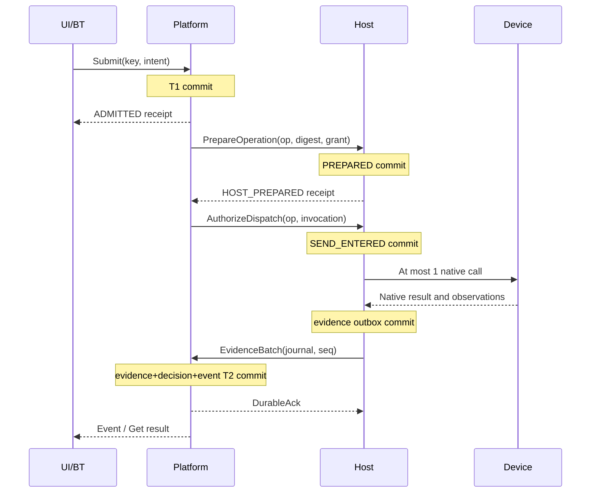

# Data, Messages, and Transport Protocol

Normative: RX Contract v1.0 · [Recovery rules](02_identity_durability_recovery.md)

## 1. Transport and endpoints

The platform↔solutions boundary uses gRPC/HTTP2 + Protobuf **proto3 optional**. The implementation candidates are fixed to the tonic/prost family for Rust and the gRPC/Protobuf family for C++. Exact toolchain/generator/library patch combinations will be locked by subsequent build validation without changing contract semantics.

The default deployment uses explicit container network endpoints on the same host. mTLS distinguishes platform, executor, and individual Host identities and enforces site-scoped roles. Each service binds only its configured internal address. Certificates/keys are read-only secret mounts and are not included in images. Only the Host accesses native robot/PLC ports. The UI accesses the HTTPS API; direct Host command APIs are not exposed.

The UI uses HTTP/JSON and SSE. HTTP and gRPC handlers invoke the same platform domain commands/validation. Do not create a separate operation ledger in the UI gateway. gRPC OK and HTTP 202 indicate request processing/acceptance, not operation outcomes.

The HTTP surface is fixed to `POST /api/v1/operations` (Submit), `GET /api/v1/operations/{id}` (Get), `GET /api/v1/operations/by-key/{key}` (Submit Lookup), `POST /api/v1/operations/{id}/cancel`, `POST /api/v1/operations/{id}/reconcile`, `POST /api/v1/operations/{id}/disposition`, `POST /api/v1/runs`, `GET /api/v1/runs/{id}`, `POST /api/v1/runs/{id}/{start|pause|abandon}`, `POST /api/v1/profiles/evaluate`, `GET /api/v1/snapshot`, `GET /api/v1/snapshot/{id}?continuation=...`, and `GET /api/v1/events?after=...`. Host/executor-only RPCs are not exposed over HTTP.

HTTP mutation bodies use the corresponding RPC's JSON projection; reject mismatched path/body IDs. Put request_key and expected_revision in the body context. The authenticated identity determines the client namespace for GET key lookups. Cursor queries and SSE `id` encode Cursor JCS bytes as base64url without padding. If Last-Event-ID and after are both supplied, they must match. Snapshot GET fixes the view to site-control-v1. SSE `event` is the EventType token; `data` is Event JSON. Error bodies use the JSON projection of ErrorDetail, and all uint64 values in normal HTTP bodies also follow the decimal-string rule.

Evidence lookup is provided at `GET /api/v1/evidence/{id}`. The UI representation of observation streams uses a separate `GET /api/v1/telemetry` SSE on the same API, without a control-journal cursor. Display explicit source/sample information and dropped count.

## 2. Common representation rules

In the tables below, `name:type#n` denotes Protobuf field number n. `?` denotes optional presence, `[]` repeated, and `|` oneof. Requiredness is an RX validation rule; proto3 `required` is not used. Deleted numbers/names are permanently reserved. The v1 message package is `rx.contract.v1`.

| Type | Representation/constraints |
|---|---|
| Id | string, standard lowercase hyphenated UUID. Only the BT activation-slot key form is separately permitted |
| Name | string, `[A-Za-z0-9][A-Za-z0-9._/-]{0,127}`. Native ROS names and user display names use separate fields |
| Digest | bytes, 32-byte SHA-256. JSON uses 64 lowercase hexadecimal characters |
| Counter / DurationMs | uint64. JSON/JCS uses decimal strings without leading zeros. seq/revision is at least 1 |
| Real | double, finite values only. Normalize -0 to +0. Units are fixed by the schema |
| TimePoint | `{clock_id:string#1, ticks_ns:uint64#2}`. Compare only within the same clock_id |
| UtcTime | RFC3339 UTC string for records. Must not determine physical-command validity |
| ArtifactRef | `{sha256:Digest#1, schema_id:Name#2, size_bytes:uint64#3}`. Content address for locally deployed data; arbitrary URL downloads during execution are prohibited |
| Version | `{major:uint32#1, minor:uint32#2, schema_hash:Digest#3}`. Reject absent/0 major |

Every enum uses 0=UNSPECIFIED, which is not a valid command/decision input. Do not convert an unrecognized enum to the string UNKNOWN. Actual “unknown outcome” values differ from enums unrecognized by the parser.

Validate protobuf unknown fields against the input schema descriptor before decoding and reject them in command/evidence inputs. Reject duplicate singular fields, multiple oneof arms, and duplicate map keys. Contract validators must enforce this even if generators default to skip/last-wins behavior. Array order preserves meaning.

## 3. Contract message dictionary

| Message | Fields and meaning |
|---|---|
| PeerHello | `peer_id:Name#1, role:Role#2, boot_id:Id#3, installation_id:Id#4, store_generation:Id#5, supported_versions:Version[]#6, release_digest:Digest#7, journal_id:Id?#8, last_seq:uint64?#9, shared_clock_id:string#10`. journal_id is the evidence outbox ID, separate from the receipt delivery ID |
| Session | `session_id:Id#1, peer_id:Name#2, boot_id:Id#3, selected_version:Version#4, required_features:Name[]#5, limits:Limits#6`. Bound to the authenticated channel |
| CallContext | `session_id:Id#1, call_id:Id#2, request_key:string?#3, expected_revision:uint64?#4`. call_id traces transport; request_key identifies mutations |
| SubmitOperation | `context:CallContext#1, intent:Intent#2, run_id:Id?#3, activation_id:Id?#4, slot:Name?#5`. Executors require all three final fields |
| Intent | `kind:Kind#1, target:Name#2, profile_digest:Digest#3, site_config_digest:Digest#4, calibration_digests:Digest[]#5, resource_set:Name[]#6, execution_timeout_ms:uint64#7, prepare_validity_ms:uint64#8, completion_rule:Name#9, cancel_rule:Name#10, body:Body#11` |
| Body | oneof `trajectory:TrajectoryGoal#1 \| program:ProgramGoal#2 \| predicate:PredicateGoal#3 \| mode:ModeGoal#4 \| control:ControlGoal#5 \| lifecycle:LifecycleGoal#6` |
| TrajectoryGoal | `trajectory:ArtifactRef#1, joint_group:Name#2, tool_digest:Digest#3`. Finite action; artifact includes joint names, SI units, times, targets, and tolerances |
| ProgramGoal | `program:ArtifactRef#1, parameter_set:ArtifactRef#2`. Finite action; does not directly execute opaque free-form script strings |
| PredicateGoal | `predicate_id:Name#1, target:TypedValue#2, settle_ms:uint64#3`. Ensure-state; fixes writes and observations permitted by the profile |
| ModeGoal | `mode_id:Name#1, transition_profile:Digest#2`. Mode transition |
| ControlGoal | `source_id:Name#1, sample_schema:Name#2, stream_profile:Digest#3`. Control session |
| LifecycleGoal | `transition:LifecycleVerb#1, target_level:Name#2, support_evidence:Id[]#3`. PREPARE/ACTIVATE/DEACTIVATE/SHUTDOWN |
| TypedValue | oneof `boolean:bool#1 \| integer:sint64#2 \| real:double#3 \| symbol:Name#4 \| reals:RealVector#5`. RealVector=`values:double[]#1`. value_schema fixes permitted arms/dimensions/units |
| Receipt | `operation_id:Id#1, intent_digest:Digest#2, operation_revision:uint64?#3, stage:ReceiptStage#4, invocation_id:Id?#5, journal_id:Id#6, journal_seq:uint64#7, host_state:HostReceiptState?#8, cancel_id:Id?#9`. Presence of cancel_id identifies a cancel receipt, not a production receipt. The Host does not issue platform revisions |
| OperationView | `operation_id:Id#1, revision:uint64#2, intent_digest:Digest#3, phase:Phase#4, execution_knowledge:Knowledge#5, outcome:Outcome#6, integrity:Integrity#7, disposition:Disposition#8, evidence_ids:Id[]#9, reason:Reason#10, control_state:ControlState?#11, cancel_ids:Id[]#12`. NONE outcome is the explicit value in 01, not 0 |
| OperationRef | `context:CallContext#1, operation_id:Id#2` |
| CancelRequest | `context:CallContext#1, operation_id:Id#2, cancel_rule:Name#3, reason:Reason#4, intent_digest:Digest#5, cancel_id:Id?#6`. cancel_id is absent at C01, issued by P in T4, and required at C03. A new key is required. Do not issue native wildcard cancellation of all other operations |
| GrantRequest | `context:CallContext#1, resource_set:Name[]#2, fence:uint64#3, owner_id:Name#4, requested_ttl_ms:uint64#5` |
| Grant | `grant_id:Id#1, host_boot_id:Id#2, fence:uint64#3, resource_set:Name[]#4, ttl_ms:uint64#5, owner_id:Name#6`. Expiry itself is a Host-internal monotonic value |
| RenewGrant | `context:CallContext#1, grant_id:Id#2, renew_seq:uint64#3`. The same sequence returns only the existing response |
| PrepareOperation | `context:CallContext#1, operation_id:Id#2, intent:Intent#3, intent_digest:Digest#4, grant:Grant#5` |
| AuthorizeDispatch | `context:CallContext#1, operation_id:Id#2, invocation_id:Id#3, intent_digest:Digest#4, grant:Grant#5` |
| Observation | `observation_id:Id#1, source_id:Name#2, source_boot_evidence:string?#3, receive_boot_id:Id#4, receive_time:TimePoint#5, sample_seq:uint64?#6, source_time:TimePoint?#7, quality:Quality#8, value_schema:Name#9, value:TypedValue#10, correlation:Correlation#11, freshness_basis:FreshnessBasis#12, uncertainty_ms:uint64?#13` |
| Correlation | `operation_id:Id?#1, invocation_id:Id?#2, native_id:string?#3, device_session_id:Id#4, profile_digest:Digest#5, cancel_id:Id?#6`. Cancel results require cancel_id; invocation_id is the separate ID of that cancel call. Production results omit cancel_id |
| Evidence | `evidence_id:Id#1, evidence_schema:Name#2, profile_digest:Digest#3, body:EvidenceBody#4`. EvidenceBody selects observation#1/native_result#2/attestation#3 |
| NativeResult | `correlation:Correlation#1, native_status_schema:Name#2, native_status:sint64#3, native_data:ArtifactRef?#4, captured_at:TimePoint#5`. Schema defines status semantics |
| Attestation | `actor_id:Name#1, procedure_digest:Digest#2, assertion_id:Name#3, value:TypedValue#4, observed_at:UtcTime#5, scope:Name[]#6`. Separate from native results |
| EvidenceBatch | `context:CallContext#1, producer_journal_id:Id#2, first_seq:uint64#3, records:Evidence[]#4`. Contiguous record sequence numbers are first_seq+array index |
| DurableAck | `producer_journal_id:Id#1, through_seq:uint64#2, platform_cursor:Cursor#3` |
| Event | `event_id:Id#1, cursor:Cursor#2, event_type:EventType#3, operation_id:Id?#4, entity_revision:uint64#5, evidence_ids:Id[]#6, entity:EntityView#7`. EntityView is the typed oneof operation#1/run#2/resource#3/release#4 |
| Cursor | `installation_id:Id#1, store_generation:Id#2, seq:uint64#3, view_id:Name#4`. seq=0 is allowed for requests from the beginning or Snapshot.through on an empty ledger. After an empty snapshot use after=0; first event seq=1 |
| Snapshot | `snapshot_id:Id#1, through:Cursor#2, entities:EntityView[]#3, continuation:string?#4`. Pages share a DB cut. After the last page, Subscribe.after=through yields through.seq+1 as the first delivered event |
| SubscribeRequest | `context:CallContext#1, after:Cursor#2, max_batch:uint32#3` |
| EvidenceRef | `context:CallContext#1, evidence_id:Id#2` |
| ObservationQuery | `context:CallContext#1, source_ids:Name[]#2, value_schemas:Name[]#3`. Read targets are limited by role/profile scope |
| ObservationBatch | `observations:Observation[]#1, dropped_count:uint64#2`. Telemetry has no contiguous-delivery guarantee |
| Limits | `max_message_bytes:uint32#1, max_batch_records:uint32#2, subscriber_buffer_bytes:uint32#3, max_inflight:uint32#4` |
| Reason | `code:ReasonCode#1, detail:string?#2, related_ids:Id[]#3`. detail is for human diagnostics, at most 4096 UTF-8 bytes; machine decisions must not use it |
| ErrorDetail | `reason:Reason#1, retry_action:RetryAction#2, operation_id:Id?#3, expected_revision:uint64?#4, earliest_cursor:Cursor?#5, next_expected_seq:uint64?#6` |

For order-insensitive `resource_set/calibration_digests/evidence_ids/scope`, reject duplicates and normalize into canonical ascending order. Trajectory joint arrays/sample vectors follow the schema's fixed order and are not automatically sorted.

Assign enum numbers from 1 in the order enumerated in the text. Role=PLATFORM, EXECUTOR, HOST, OPERATOR_API. Kind/Phase/Knowledge/Outcome/Integrity/Disposition follow the table order in 01. ReceiptStage=ADMITTED, HOST_PREPARED, SEND_ENTERED, NATIVE_ACCEPTED, RESULT_RECORDED. Quality=GOOD, UNCERTAIN, BAD. FreshnessBasis=SOURCE_SAMPLE, PACKET_RECEIPT, READ_TRANSACTION, CACHED_UNKNOWN. ControlState=OPENING, OPEN, CLOSING, CLOSED. Remaining reason/event values are defined below and in the auxiliary-object section.

HostReceiptState is ordered PREPARED, SEND_ENTERED, NATIVE_REJECTED, NATIVE_ACCEPTED, RESULT_CAPTURED, VOIDED_BEFORE_SEND. ReceiptStage describes the stage reached; HostReceiptState is the current delivery-journal state. VOIDED_BEFORE_SEND is a no-native-call tombstone that blocks late Prepare/Authorize. The common 0=UNSPECIFIED rule applies.

Append NOT_DISPATCHED=6 as ReceiptStage's final value. This stage with VOIDED_BEFORE_SEND also represents a cancellation tombstone created before the first Prepare. A cancel receipt's invocation_id differs from the original production invocation UUID and is issued by Host at cancel PREPARED commit. If handled as VOIDED_BEFORE_SEND without a native cancel call, invocation_id is absent.

## 4. Auxiliary objects and events

| Object | Fields |
|---|---|
| RunView | `run_id:Id#1, revision:uint64#2, recipe_digest:Digest#3, state:RunState#4, checkpoint:Checkpoint#5, executor_session_id:Id?#6`. RunState=PREPARED, EXECUTING, PAUSED, RECOVERY_REQUIRED, COMPLETED, ABANDONED |
| Checkpoint | `run_id:Id#1, revision:uint64#2, executor_schema:Name#3, payload:ArtifactRef#4, activations:ActivationView[]#5`. Validate the executor state artifact against the release-pinned schema |
| ActivationView | `activation_id:Id#1, node_id:Name#2, visit:uint64#3, slots:SlotBinding[]#4`. SlotBinding=`slot:Name#1, operation_id:Id#2, intent_digest:Digest#3` |
| ResourceView | `resource_id:Name#1, revision:uint64#2, fence:uint64#3, disposition:Disposition#4, owner_id:Name?#5, hold_reason:Reason#6` |
| ReleaseView | `release_digest:Digest#1, site_config_digest:Digest#2, revision:uint64#3, admitted_profiles:Digest[]#4, rejected_profiles:ProfileFinding[]#5`. ProfileFinding=`profile:Digest#1, reason:Reason#2, finding:FindingCode#3, support_id:Name#4` |
| ChangeCheckpoint | `context:CallContext#1, run_id:Id#2, expected_revision:uint64#3, new_checkpoint:Checkpoint#4`. Runtime owns operation mapping; existing bindings must not be overwritten |
| ResolveActivation | `context:CallContext#1, run_id:Id#2, node_id:Name#3, visit:uint64#4`. Platform atomically assigns one activation ID per (run,node,visit) or returns the existing value |
| EvaluateProfile | `context:CallContext#1, target:Name#2, profile_digest:Digest#3, site_config_digest:Digest#4`. Returns `ProfileEvaluation{findings#1, release_view#2}` with ProfileFinding[] |
| SnapshotPageRequest | `context:CallContext#1, snapshot_id:Id#2, continuation:string#3` |
| RevokeGrantRequest | `context:CallContext#1, grant_id:Id#2, new_fence:uint64#3, reason:Reason#4` |
| RunRequest | `context:CallContext#1, run_id:Id?#2, recipe_digest:Digest#3, site_config_digest:Digest#4`. Creation requires a key; changes require run_id+revision |
| RecoveryDisposition | `context:CallContext#1, operation_id:Id#2, expected_revision:uint64#3, evidence_ids:Id[]#4, procedure_digest:Digest#5, disposition:Disposition#6, reason:Reason#7`. Cannot write outcome directly |
| StreamTicket | `ticket_id:Id#1, session_id:Id#2, host_boot_id:Id#3, valid_for_ms:uint64#4`. Expiry issued/retained by Host |
| ControlSample | `session_id:Id#1, source_boot_id:Id#2, source_seq:uint64#3, ticket:StreamTicket#4, values:TypedValue#5, source_evidence_ids:Id[]#6`. Internal solutions exchange |

EventType numbers follow OPERATION_ADMITTED, HOST_RECEIPT_RECORDED, EVIDENCE_RECORDED, OPERATION_REVISED, CANCEL_REQUESTED, RESOURCE_REVISED, RUN_REVISED, RELEASE_REVISED, INTEGRITY_DISPUTED, RECOVERY_DISPOSITION_RECORDED. Canonical core events include the entity's post-commit view so consumers need not parse string detail. Raw telemetry is not an Event.

## 5. RPC surface

All mutations check key, authenticated identity, and expected revision when changing an existing object. Automatic RPC hedging is prohibited. Transport retries preserve the same request/key; the rules in 02 prevent repeated native effects.

Check in this order: authentication/current access → key and complete mutation-intent identity → CAS/execution eligibility for first-seen requests. An identical request with an existing key returns the already-applied result without creating a new conflict over an old expected_revision. ChangeCheckpoint/Recovery use only body expected_revision; the context field must be absent. Run changes check RunView.revision using context expected_revision. A new executor slot in Submit checks RunView.revision and execution generation using context expected_revision. New client standalone operations do not use context revision. Host operations use operation/digest/HostReceiptState CAS, grants use fence+owner, and renewals use grant_id+renew_seq CAS; none requires platform revision. Evidence.Publish uses outbox seq CAS. Lookup/pagination does not require a mutation key.

| Service/RPC | Input → output | Effect |
|---|---|---|
| Session.Open | PeerHello → Session | Version/release/role negotiation; no motion authority |
| Operation.Submit | SubmitOperation → Receipt | T1; unique operation allocation |
| Operation.Get | OperationRef → OperationView | Persistent view lookup |
| Operation.Lookup | CallContext(key required) → Receipt | Lost-response key→operation lookup in the Operation.Submit method scope. For other mutations, repeat their RPC with the same key |
| Operation.RequestCancel | CancelRequest → OperationView | T4; does not promise an outcome change |
| Operation.Reconcile | OperationRef → OperationView | Starts a read/query plan; no native production retransmission |
| Recovery.RecordDisposition | RecoveryDisposition → OperationView | T5; operational authority required |
| Workflow.CreateRun | RunRequest → RunView | Creates a PREPARED run with immutable recipe/site config |
| Workflow.StartRun / PauseRun / AbandonRun | RunRequest → RunView | Requests EXECUTING/blocks new activations/abandons after investigation, respectively. Pause does not mean already-started physical work has stopped |
| Workflow.GetRun | RunRequest(run_id) → RunView | Restores checkpoint/activation/slot |
| Workflow.ResolveActivation | ResolveActivation → ActivationView | Unique activation for the same run/node/visit. Validates visit against recipe loop rules and checkpoint |
| Workflow.CommitCheckpoint | ChangeCheckpoint → RunView | T3 CAS; preserves existing child IDs |
| Admission.EvaluateProfile | EvaluateProfile → ProfileEvaluation | Checks C06 installed immutable profile/site configuration and current Host conditions. Not motion authorization itself |
| Host.AcquireGrant | GrantRequest → Grant | Stores resource fence; previous-owner handover must be complete |
| Host.RenewGrant | RenewGrant → Grant | Increasing sequence; rejected after expiry |
| Host.PrepareOperation | PrepareOperation → Receipt | Host durable PREPARED |
| Host.AuthorizeDispatch | AuthorizeDispatch → Receipt | SEND_ENTERED and at most 1 native call |
| Host.GetReceipt | OperationRef → Receipt | Host journal lookup; distinguishes absence from SEND_ENTERED |
| Host.GetCancelReceipt | CancelRequest(cancel_id required) → Receipt | Cancel journal lookup. Read calls do not perform mutation-key/CAS checks |
| Host.CancelOperation | CancelRequest → Receipt | Profile native cancel path; call completion≠stop completion |
| Host.Reconcile | OperationRef → EvidenceBatch | Reads existing invocation results/current state |
| Host.WatchObservations | ObservationQuery → stream ObservationBatch | C04 observations. May be latest-only; preserves age/quality/seq |
| Evidence.Publish | EvidenceBatch → DurableAck | T2; ack after contiguous inbox commit |
| Evidence.Get | EvidenceRef → Evidence | Immutable evidence lookup. Explicit error if archived/unavailable; never substitute arbitrary latest values |
| Journal.GetSnapshot | SubscribeRequest → Snapshot | First page at a consistent cut. after selects only the view; requested seq does not constrain snapshot cut |
| Journal.GetSnapshotPage | SnapshotPageRequest → Snapshot | Next page at the same cut. Token binds actor/view/snapshot |
| Journal.Subscribe | SubscribeRequest → stream Event | Replay after the cursor plus live events. Error if cursor expired |

Do not mix snapshot continuation with mutation request_key. The final page omits continuation. Do not arbitrarily interleave earlier pages with the live stream.

ChangeCheckpoint's new_checkpoint.revision must equal expected_revision+1; it cannot alter the existing run ID or activation/slot bindings. P commits the run revision transactionally. Commits changing RunView activation content, such as ResolveActivation/new-slot allocation, also increment run revision. On conflict, the executor retrieves the new revision and already-created child mappings through GetRun.

Host grant revocation and stream closure are provided as `Host.RevokeGrant(RevokeGrantRequest)→GrantRevocation` and `Host.CloseControlSession(CancelRequest)→Receipt`. `GrantRevocation{grant_id:Id#1,new_fence:uint64#2,evidence_ids:Id[]#3,reason:Reason#4}` is a receipt invalidating the existing grant. The Host does not independently establish resource RELEASED or platform OperationView. The platform receives evidence and decides handover. `Host.NextStreamTicket(OperationRef)→StreamTicket` and `Host.PushSample(ControlSample)→Reason` are internal solutions endpoints, not platform APIs. `Reason=OK` means only sample acceptance, not target attainment.

## 6. Normal exchange and lost responses

If Prepare/Authorize responses are lost, use GetReceipt. NOT_FOUND is meaningful only in the same surviving Host journal. A changed/lost journal_id is not evidence of non-execution. SEND_ENTERED proceeds only through Reconcile. SDK calls follow the single-delivery rules in 02.

## 7. Ordering, duplicates, snapshots, and slow consumers

Distinguish three orders: Host journal seq is the producer's durable evidence order, platform seq is the order of events accepted into the DB, and device sample seq is device-defined observation order. Platform seq does not establish actual physical occurrence order across devices.

The Host journal above is the **evidence outbox journal**. Delivery-journal seq from PREPARED/SEND_ENTERED receipts is not part of this stream. P's events recording received receipts appear separately in the platform stream. Do not mix the two Host sequences when detecting GAP.

Evidence.Publish accepts only contiguous batches within the same journal. A duplicate prefix matching stored digests is acknowledged; different evidence at the same seq produces INTEGRITY_CONFLICT. Arrival ahead of the next required seq returns GAP with next_expected. If missing records cannot be recovered, record a gap incident and new journal boundary, and withhold completion inference.

Host.Reconcile responses follow the same evidence-outbox contiguous-batch rules. Do not select only records for one operation while skipping sequence numbers. P applies both Publish requests and Reconcile responses through the same T2 inbox. H's background Publish repeats until durable ack, so a record first applied from a Reconcile response receives only a duplicate ack when delivered again.

v1 event subscriptions are fixed to **the complete control-ledger view of one installation**. Only `view_id=site-control-v1` is supported, with no server-side filtering. Reject subscriptions by actors lacking read access to the entire view. A skipped seq therefore denotes a missing event. Cursors cannot be reused across installation/store generations. Future partial-permission views need separately designed sequences/schemas.

A Snapshot provides current operation/run/resource/release views and a through cursor at one DB cut. All pages retain that cut; on expiry, restart from the beginning. A snapshot does not mean multiple devices were observed at the same physical instant. After applying it, the subscriber replays events following through.

The after cursor in a resubscription request is **exclusive**. After a snapshot, use `after=through`; if the last applied event is N, use `after.seq=N`, and the first returned event is N+1. Consumers persist event_id/cursor with the durable application position to avoid reapplying duplicate delivery.

When an event buffer reaches its limit, terminate that subscriber with SLOW_CONSUMER instead of dropping events. Do not block producer/native control loops for that consumer. The consumer reconnects from its last applied cursor. Outside retention, CURSOR_EXPIRED with earliest requires restoration through a snapshot. Historical evidence lookup for audit and restoration of current views are separate.

Telemetry may coalesce to the latest value but must display source seq, quality, dropped count, and age. Do not handle telemetry loss as if it were control-ledger event loss. Telemetry used in a decision must be promoted to Evidence and stored through T2.

The entity of an EVIDENCE_RECORDED event is its OperationView when operation correlation exists; otherwise it is the ResourceView to which the source belongs. Profiles must supply source→resource mappings. Evidence itself is immutably retrieved through evidence_ids. Mere keepalive/heartbeat traffic cannot refresh observation age or establish device GOOD.

## 8. Software limits and time values

| Item | v1 default/range | On excess/expiry |
|---|---|---|
| Unary message | At most 1 MiB after decompression | RESOURCE_EXHAUSTED; no acceptance |
| EvidenceBatch | At most 128 records and at most 1 MiB | Split batches. Individual large data uses predistributed/retained ArtifactRef |
| Subscriber memory | First of 4 MiB or 1024 events | SLOW_CONSUMER termination; reconnect by cursor |
| Peer in-flight mutations | At most 32 | BUSY. Unbounded internal queues prohibited |
| Normal RPC response wait | Default 3 seconds for reads/acceptance | Response timeout; look up operation outcome |
| Snapshot page | At most 128 entities/1 MiB; retain snapshot for 60 seconds | Restart after SNAPSHOT_EXPIRED |
| Online control-event resubscription | At least 7 days; size capacity separately for site event rate | Old cursors require snapshots. Do not delete key tombstones/unresolved evidence |
| Unresolved operations/Host unacknowledged evidence | Automatic deletion prohibited | Block new admission before storage pressure |
| Grant TTL/stream ticket/deadman/execution/freshness/shutdown | **Profile required**; no arbitrary global defaults | Reject admission if absent or mutually incompatible |

These are design defaults for implementation resource limits, not validated robot response/stop times or production rates. Release profiles may choose smaller limits. Larger limits require memory/stop-path independence validation and a new profile revision. Default to warning at 20% free storage and blocking new production admission at 10%, while reserving separate capacity and paths for completion/local protective reactions.

## 9. Canonical intent and digests

intent_digest is `SHA256(UTF8("RX-INTENT-v1\n") || JCS(CanonicalIntent))`. Do not hash Protobuf bytes. CanonicalIntent field names match the Intent table's snake_case names; body is an object keyed by the selected arm name.

Normalization proceeds as follows.

1. Validate required values, enums, oneof, ranges, and duplicate fields against the negotiated schema. Reject unknown fields, NaN, Infinity, and null.
2. Accept only schema-fixed SI units. UI deg/mm conversion occurs before submission. **Fully expand profile defaults before acceptance** and include them in canonical intent. Retries use the original profile revision.
3. Sort only sortable sets. Normalize Id/Name/digest representations. Do not implicitly convert bool to/from numbers/strings. Unicode labels are display metadata outside intent; execution names follow Name rules.
4. Represent uint64/sint64 as JSON decimal strings, byte digests as hex, and double as RFC8785 numbers. -0→0. Do not merge different intents using floating-point tolerance.
5. Apply JCS key ordering/serialization and calculate the digest. The Host calculates and compares it using the same schema/profile.

Include all Intent fields, body artifact hash/size/schema, calibration, tool, timing, and completion/cancel policies. Exclude operation_id, caller key, call_id, authentication token, network address, UI label, and receive time. Store run/activation/slot in identity mapping but omit them from the intent-content hash. Keys/operation IDs distinguish the same physical intent across runs.

Project CanonicalIntent enums to the uppercase token strings defined in the tables. Nested messages are objects with snake_case fields. A oneof is an object with its single selected arm. Example: `{"predicate":{"predicate_id":"door.closed","settle_ms":"0","target":{"boolean":true}}}`. Include every repeated field as `[]` even if empty. Absent optional fields are omitted, distinct from null. `TypedValue.integer` is a decimal string, `real` a JCS number, and `reals` is `{"values":[...]}`. Digest and Name/Id representations follow §2. Do not delegate to arbitrary enum/bytes formats from protobuf JSON serializers.

Evidence and Receipt use the same field/enum/oneof projection rules, including all present fields. Check content identity with `SHA256(UTF8("RX-EVIDENCE-v1\n") || JCS(Evidence))` and `SHA256(UTF8("RX-RECEIPT-v1\n") || JCS(Receipt))`, respectively. Rewriting the original evidence_id/source time/journal sequence creates a different record. Do not append dynamically computed age or transport-retry metadata to original evidence.

| Compatibility vector | Decision |
|---|---|
| Only JSON key order changes | Same digest |
| resource_set order changes | Same digest; reject duplicate elements |
| Trajectory joint order and corresponding values change | Different digest if artifact content differs; arbitrary reordering prohibited |
| Omitted optional vs explicit default | Identical only if the profile permits omission and expands the same default |
| false vs missing required bool | false is a value; absence is an error |
| `1.0` vs `1e0`, `-0.0` vs `0.0` | Same canonical double |
| User representations 1000ms vs 1s | API accepts only integer-string milliseconds. Reject arbitrary unitless representations |
| Same key with changed calibration/profile/tool digest | KEY_CONFLICT |
| Unknown enum/field/body arm | UNSUPPORTED_SCHEMA; silently choosing default behavior prohibited |

## 10. Versions, errors, and authority

v1 command/evidence exchange negotiates the same major and **identical schema_hash**. Matching minor numbers alone do not imply compatibility. Peers explicitly supporting multiple schemas select a common hash. Without one, expose an observable incompatibility state only and block command/evidence decisions. Ignoring a new UI display field differs from ignoring an unknown native-command field.

`schema_hash` is the SHA-256 of **the JCS bytes themselves** of the baseline's distributed `protocol_manifest.json`. The manifest contains wire package/version and SHA-256 values for normative documents 01–04. Both sides use the same manifest artifact rather than hashing independently generated descriptor bytes. Subsequent code releases must pin conformance tests and digests for IDL/generator output corresponding to this baseline in a separate release manifest. Matching document digests alone does not prove generated-code conformance.

| ReasonCode (numbered from 1 in order) | gRPC / HTTP | RetryAction |
|---|---|---|
| OK | OK / 200 or 202 | NONE |
| INVALID_ARGUMENT | INVALID_ARGUMENT / 400 | FIX_REQUEST |
| UNAUTHENTICATED | UNAUTHENTICATED / 401 | AUTHENTICATE |
| FORBIDDEN | PERMISSION_DENIED / 403 | NONE |
| KEY_CONFLICT | ALREADY_EXISTS / 409 | INSPECT_EXISTING |
| REVISION_CONFLICT | ABORTED / 409 | REFRESH |
| BUSY | RESOURCE_EXHAUSTED / 429 | RETRY_SAME_KEY |
| UNSUPPORTED_SCHEMA | FAILED_PRECONDITION / 409 | CHANGE_RELEASE |
| CAPABILITY_MISSING | FAILED_PRECONDITION / 422 | RECONFIGURE |
| PRECONDITION_FAILED | FAILED_PRECONDITION / 422 | RECONCILE |
| STALE_AUTHORITY | FAILED_PRECONDITION / 409 | REACQUIRE |
| EXPIRED | FAILED_PRECONDITION / 409 | RECONCILE |
| UNKNOWN_OUTCOME | FAILED_PRECONDITION / 409 | RECONCILE |
| NOT_FOUND | NOT_FOUND / 404 | INSPECT_EXISTING |
| GAP | OUT_OF_RANGE / 409 | REPLAY |
| CURSOR_EXPIRED | OUT_OF_RANGE / 410 | SNAPSHOT |
| SNAPSHOT_EXPIRED | OUT_OF_RANGE / 410 | SNAPSHOT |
| SLOW_CONSUMER | RESOURCE_EXHAUSTED / 429 | REPLAY |
| STORE_FAULT | UNAVAILABLE / 503 | RECONCILE |
| INTEGRITY_CONFLICT | DATA_LOSS / 409 | RECONCILE |
| ALREADY_SETTLED | OK / 200 | NONE |
| RESOURCE_EXHAUSTED | RESOURCE_EXHAUSTED / 413 | FIX_REQUEST |

RetryAction enum order is NONE, FIX_REQUEST, AUTHENTICATE, INSPECT_EXISTING, REFRESH, RETRY_SAME_KEY, CHANGE_RELEASE, RECONFIGURE, RECONCILE, REACQUIRE, REPLAY, SNAPSHOT. Plain transport DEADLINE_EXCEEDED/UNAVAILABLE does not reveal commit status; confirm with Lookup/Get. Native failures are separate Evidence/Outcome values, not this RPC error table.

Separate observer, production operator, recovery owner, configuration administrator, executor, and Host roles. Recovery/disposition and release changes require separate authority and audit. Error handlers must not independently approve release/new commands/new keys. Certificate rotation preserves stable peer identity but requires renegotiation; authority changes are propagated/revoked separately from existing grants.
