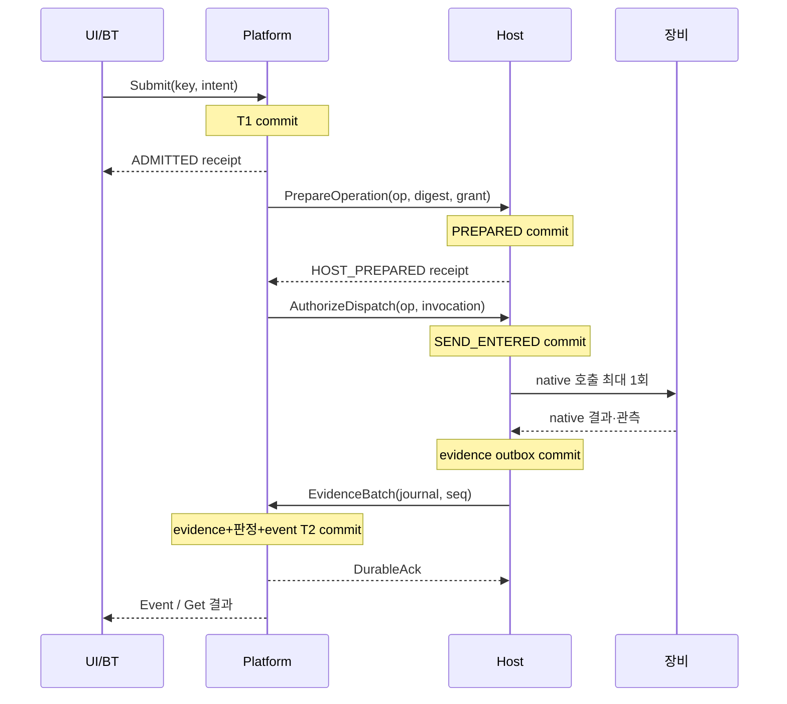

# 데이터·메시지·전송 규약

규범: RX 계약 v1.0 · [복구 규칙](02_identity_durability_recovery.md)

## 1. 전송과 endpoint

platform↔solutions는 gRPC/HTTP2 + Protobuf **proto3 optional**을 사용한다. Rust는 tonic/prost 계열, C++는 gRPC/Protobuf 계열을 구현 후보군으로 고정한다. 정확한 toolchain·generator·library patch 조합은 이후 빌드 검증에서 lock하며 계약 의미를 바꾸지 않는다.

기본 배치는 같은 호스트의 명시적 컨테이너 network endpoint다. mTLS로 platform·executor·각 Host identity를 구별하고 site-scoped 역할을 검사한다. 각 서비스는 설정된 내부 주소에만 bind한다. 인증서·키는 read-only secret mount이며 이미지 안에 넣지 않는다. native robot/PLC port는 Host만 접근한다. UI는 HTTPS API에 접근하고 Host의 직접 명령 API는 공개하지 않는다.

UI는 HTTP/JSON과 SSE를 사용한다. HTTP handler와 gRPC handler는 같은 platform domain command/validation을 호출한다. UI gateway에 별도 작업 원장을 만들지 않는다. gRPC 상태 OK, HTTP 202는 요청 처리/접수의 상태이며 outcome을 대신하지 않는다.

HTTP 표면은 `POST /api/v1/operations`(Submit), `GET /api/v1/operations/{id}`(Get), `GET /api/v1/operations/by-key/{key}`(Submit Lookup), `POST /api/v1/operations/{id}/cancel`, `POST /api/v1/operations/{id}/reconcile`, `POST /api/v1/operations/{id}/disposition`, `POST /api/v1/runs`, `GET /api/v1/runs/{id}`, `POST /api/v1/runs/{id}/{start|pause|abandon}`, `POST /api/v1/profiles/evaluate`, `GET /api/v1/snapshot`, `GET /api/v1/snapshot/{id}?continuation=...`, `GET /api/v1/events?after=...`로 고정한다. Host/executor 전용 RPC는 HTTP로 공개하지 않는다.

HTTP mutation body는 대응 RPC의 JSON 투영을 사용하며 path ID와 body ID가 다르면 거부한다. request_key와 expected_revision은 body context에 둔다. GET key 조회 scope의 client namespace는 인증 identity에서 결정한다. cursor query와 SSE `id`는 Cursor의 JCS bytes를 base64url(패딩 없음)로 인코딩한다. Last-Event-ID와 after를 함께 제시하면 같아야 한다. snapshot GET의 view는 site-control-v1로 고정한다. SSE `event`는 EventType token, `data`는 Event JSON이다. 오류 body는 ErrorDetail의 JSON 투영이며 normal HTTP body의 모든 uint64도 10진 string 규칙을 따른다.

근거 조회는 `GET /api/v1/evidence/{id}`로 제공한다. observation stream의 UI 표현은 같은 API의 별도 `GET /api/v1/telemetry` SSE를 사용하며 제어 journal cursor를 부여하지 않는다. 명시적 source/sample 정보와 dropped count를 표시한다.

## 2. 공통 표현 규칙

아래 표에서 `name:type#n`은 Protobuf field 번호 n이다. `?`는 optional presence, `[]`는 repeated, `|`는 oneof다. 필수 여부는 RX validation 규칙이며 proto3 `required`를 쓰지 않는다. 삭제한 번호·이름은 영구 reserved다. v1의 메시지 package는 `rx.contract.v1`이다.

| 타입 | 표현·제약 |
|---|---|
| Id | string, UUID lowercase 표준 hyphen 표기. key의 BT activation-slot 형식만 별도 허용 |
| Name | string, `[A-Za-z0-9][A-Za-z0-9._/-]{0,127}`. native ROS 이름·사용자 표시명은 별도 필드 |
| Digest | bytes, SHA-256 32 bytes. JSON은 lowercase hex 64자 |
| Counter / DurationMs | uint64. JSON/JCS에서는 선행 0 없는 10진 문자열. seq/revision은 1 이상 |
| Real | double, finite만 허용. -0은 +0으로 정규화. 단위는 schema에 고정 |
| TimePoint | `{clock_id:string#1, ticks_ns:uint64#2}`. 동일 clock_id에서만 비교 |
| UtcTime | 기록용 RFC3339 UTC string. 물리 명령 유효성 판정에 사용 금지 |
| ArtifactRef | `{sha256:Digest#1, schema_id:Name#2, size_bytes:uint64#3}`. 로컬 배포된 내용 주소; 실행 중 임의 URL 다운로드 금지 |
| Version | `{major:uint32#1, minor:uint32#2, schema_hash:Digest#3}`. absent/0 major는 거부 |

모든 enum은 0=UNSPECIFIED이며 명령/판정 입력에서 유효 값으로 쓰지 않는다. 미지 enum은 문자열 UNKNOWN으로 바꾸지 않는다. 실제 ‘결과 불명’ 값과 ‘파서가 모르는 enum’은 서로 다르다.

protobuf unknown field는 입력 schema descriptor 기준으로 decode 전 검증하여 command·evidence 입력에서 거부한다. duplicate singular field, oneof의 복수 arm, map 중복 key도 거부한다. generator가 기본으로 skip/last-wins를 제공하더라도 계약 validator는 이를 허용하지 않는다. 배열 순서는 의미를 보존한다.

## 3. 계약 메시지 사전

| 메시지 | 필드와 의미 |
|---|---|
| PeerHello | `peer_id:Name#1, role:Role#2, boot_id:Id#3, installation_id:Id#4, store_generation:Id#5, supported_versions:Version[]#6, release_digest:Digest#7, journal_id:Id?#8, last_seq:uint64?#9, shared_clock_id:string#10`. journal_id는 evidence outbox ID이며 receipt delivery ID와 별도 |
| Session | `session_id:Id#1, peer_id:Name#2, boot_id:Id#3, selected_version:Version#4, required_features:Name[]#5, limits:Limits#6`. session은 인증된 channel에 결합한다 |
| CallContext | `session_id:Id#1, call_id:Id#2, request_key:string?#3, expected_revision:uint64?#4`. call_id는 전송 추적용, request_key는 mutation 동일성용 |
| SubmitOperation | `context:CallContext#1, intent:Intent#2, run_id:Id?#3, activation_id:Id?#4, slot:Name?#5`. executor는 세 마지막 필드 모두 필요 |
| Intent | `kind:Kind#1, target:Name#2, profile_digest:Digest#3, site_config_digest:Digest#4, calibration_digests:Digest[]#5, resource_set:Name[]#6, execution_timeout_ms:uint64#7, prepare_validity_ms:uint64#8, completion_rule:Name#9, cancel_rule:Name#10, body:Body#11` |
| Body | oneof `trajectory:TrajectoryGoal#1 \| program:ProgramGoal#2 \| predicate:PredicateGoal#3 \| mode:ModeGoal#4 \| control:ControlGoal#5 \| lifecycle:LifecycleGoal#6` |
| TrajectoryGoal | `trajectory:ArtifactRef#1, joint_group:Name#2, tool_digest:Digest#3`. finite action, artifact가 관절 이름·SI 단위·시간·목표·허용오차를 포함 |
| ProgramGoal | `program:ArtifactRef#1, parameter_set:ArtifactRef#2`. finite action, opaque 자유 문자열 script를 직접 실행하지 않음 |
| PredicateGoal | `predicate_id:Name#1, target:TypedValue#2, settle_ms:uint64#3`. ensure-state, profile가 허용한 쓰기와 관측을 고정 |
| ModeGoal | `mode_id:Name#1, transition_profile:Digest#2`. mode transition |
| ControlGoal | `source_id:Name#1, sample_schema:Name#2, stream_profile:Digest#3`. control session |
| LifecycleGoal | `transition:LifecycleVerb#1, target_level:Name#2, support_evidence:Id[]#3`. PREPARE/ACTIVATE/DEACTIVATE/SHUTDOWN |
| TypedValue | oneof `boolean:bool#1 \| integer:sint64#2 \| real:double#3 \| symbol:Name#4 \| reals:RealVector#5`. RealVector=`values:double[]#1`. 허용 arm·차원·단위는 value_schema에 고정 |
| Receipt | `operation_id:Id#1, intent_digest:Digest#2, operation_revision:uint64?#3, stage:ReceiptStage#4, invocation_id:Id?#5, journal_id:Id#6, journal_seq:uint64#7, host_state:HostReceiptState?#8, cancel_id:Id?#9`. cancel_id가 있으면 취소 receipt이며 production receipt가 아님. Host는 platform revision을 발급하지 않음 |
| OperationView | `operation_id:Id#1, revision:uint64#2, intent_digest:Digest#3, phase:Phase#4, execution_knowledge:Knowledge#5, outcome:Outcome#6, integrity:Integrity#7, disposition:Disposition#8, evidence_ids:Id[]#9, reason:Reason#10, control_state:ControlState?#11, cancel_ids:Id[]#12`. NONE outcome은 01의 명시적 값이며 0이 아님 |
| OperationRef | `context:CallContext#1, operation_id:Id#2` |
| CancelRequest | `context:CallContext#1, operation_id:Id#2, cancel_rule:Name#3, reason:Reason#4, intent_digest:Digest#5, cancel_id:Id?#6`. C01에서는 cancel_id absent, P가 T4에서 발급하고 C03에서는 필수. 새 key 필수. 다른 작업 전체를 native wildcard cancel하지 않음 |
| GrantRequest | `context:CallContext#1, resource_set:Name[]#2, fence:uint64#3, owner_id:Name#4, requested_ttl_ms:uint64#5` |
| Grant | `grant_id:Id#1, host_boot_id:Id#2, fence:uint64#3, resource_set:Name[]#4, ttl_ms:uint64#5, owner_id:Name#6`. expiry 자체는 Host 내부 monotonic 값 |
| RenewGrant | `context:CallContext#1, grant_id:Id#2, renew_seq:uint64#3`. 같은 순번은 기존 응답만 반환 |
| PrepareOperation | `context:CallContext#1, operation_id:Id#2, intent:Intent#3, intent_digest:Digest#4, grant:Grant#5` |
| AuthorizeDispatch | `context:CallContext#1, operation_id:Id#2, invocation_id:Id#3, intent_digest:Digest#4, grant:Grant#5` |
| Observation | `observation_id:Id#1, source_id:Name#2, source_boot_evidence:string?#3, receive_boot_id:Id#4, receive_time:TimePoint#5, sample_seq:uint64?#6, source_time:TimePoint?#7, quality:Quality#8, value_schema:Name#9, value:TypedValue#10, correlation:Correlation#11, freshness_basis:FreshnessBasis#12, uncertainty_ms:uint64?#13` |
| Correlation | `operation_id:Id?#1, invocation_id:Id?#2, native_id:string?#3, device_session_id:Id#4, profile_digest:Digest#5, cancel_id:Id?#6`. 취소 결과에는 cancel_id 필수, invocation_id는 해당 취소 호출의 별도 ID. production 결과에는 cancel_id absent |
| Evidence | `evidence_id:Id#1, evidence_schema:Name#2, profile_digest:Digest#3, body:EvidenceBody#4`. EvidenceBody는 observation#1/native_result#2/attestation#3 중 하나 |
| NativeResult | `correlation:Correlation#1, native_status_schema:Name#2, native_status:sint64#3, native_data:ArtifactRef?#4, captured_at:TimePoint#5`. status 의미는 schema가 정의 |
| Attestation | `actor_id:Name#1, procedure_digest:Digest#2, assertion_id:Name#3, value:TypedValue#4, observed_at:UtcTime#5, scope:Name[]#6`. native 결과와 별도 |
| EvidenceBatch | `context:CallContext#1, producer_journal_id:Id#2, first_seq:uint64#3, records:Evidence[]#4`. records의 연속 순번은 first_seq+배열 index |
| DurableAck | `producer_journal_id:Id#1, through_seq:uint64#2, platform_cursor:Cursor#3` |
| Event | `event_id:Id#1, cursor:Cursor#2, event_type:EventType#3, operation_id:Id?#4, entity_revision:uint64#5, evidence_ids:Id[]#6, entity:EntityView#7`. EntityView=operation#1/run#2/resource#3/release#4의 typed oneof |
| Cursor | `installation_id:Id#1, store_generation:Id#2, seq:uint64#3, view_id:Name#4`. seq=0은 처음부터 요청하거나 빈 원장 Snapshot.through에 허용. 빈 snapshot 이후 after=0, 첫 사건 seq=1 |
| Snapshot | `snapshot_id:Id#1, through:Cursor#2, entities:EntityView[]#3, continuation:string?#4`. 여러 page는 동일 DB cut. 마지막 page 후 Subscribe.after=through로 요청하면 첫 전달 사건은 through.seq+1 |
| SubscribeRequest | `context:CallContext#1, after:Cursor#2, max_batch:uint32#3` |
| EvidenceRef | `context:CallContext#1, evidence_id:Id#2` |
| ObservationQuery | `context:CallContext#1, source_ids:Name[]#2, value_schemas:Name[]#3`. 읽기 대상은 role/profile 범위로 제한 |
| ObservationBatch | `observations:Observation[]#1, dropped_count:uint64#2`. telemetry로서 연속 전달 보장은 없음 |
| Limits | `max_message_bytes:uint32#1, max_batch_records:uint32#2, subscriber_buffer_bytes:uint32#3, max_inflight:uint32#4` |
| Reason | `code:ReasonCode#1, detail:string?#2, related_ids:Id[]#3`. detail은 사람 진단용 최대 4096 UTF-8 bytes; machine 판단 금지 |
| ErrorDetail | `reason:Reason#1, retry_action:RetryAction#2, operation_id:Id?#3, expected_revision:uint64?#4, earliest_cursor:Cursor?#5, next_expected_seq:uint64?#6` |

정렬이 의미 없는 `resource_set/calibration_digests/evidence_ids/scope`는 중복을 거부하고 canonical 오름차순으로 정규화한다. trajectory 관절 배열·sample vector는 schema의 고정 순서이며 자동 정렬하지 않는다.

enum 번호는 본문에서 열거된 순서대로 1부터 부여한다. Role=PLATFORM, EXECUTOR, HOST, OPERATOR_API. Kind/Phase/Knowledge/Outcome/Integrity/Disposition은 01 표의 순서를 따른다. ReceiptStage=ADMITTED, HOST_PREPARED, SEND_ENTERED, NATIVE_ACCEPTED, RESULT_RECORDED. Quality=GOOD, UNCERTAIN, BAD. FreshnessBasis=SOURCE_SAMPLE, PACKET_RECEIPT, READ_TRANSACTION, CACHED_UNKNOWN. ControlState=OPENING, OPEN, CLOSING, CLOSED. 나머지 이유/사건 값은 아래 표와 보조 객체 절에서 정의한다.

HostReceiptState는 PREPARED, SEND_ENTERED, NATIVE_REJECTED, NATIVE_ACCEPTED, RESULT_CAPTURED, VOIDED_BEFORE_SEND 순이다. ReceiptStage는 도달한 단계의 정보, HostReceiptState는 전달 journal의 현재 상태다. VOIDED_BEFORE_SEND는 native 미호출 tombstone이며 늦은 Prepare/Authorize를 금지한다. 0=UNSPECIFIED 공통 규칙을 적용한다.

ReceiptStage의 마지막 값으로 NOT_DISPATCHED=6을 추가한다. 최초 Prepare 전에 취소 tombstone을 만든 경우에도 이 stage와 VOIDED_BEFORE_SEND를 표현할 수 있다. cancel receipt의 invocation_id는 원래 production invocation과 다른 UUID이며 Host가 cancel PREPARED commit에서 발급한다. native 취소 호출 없이 VOIDED_BEFORE_SEND로 처리하면 invocation_id는 absent다.

## 4. 보조 객체와 사건

| 객체 | 필드 |
|---|---|
| RunView | `run_id:Id#1, revision:uint64#2, recipe_digest:Digest#3, state:RunState#4, checkpoint:Checkpoint#5, executor_session_id:Id?#6`. RunState=PREPARED, EXECUTING, PAUSED, RECOVERY_REQUIRED, COMPLETED, ABANDONED |
| Checkpoint | `run_id:Id#1, revision:uint64#2, executor_schema:Name#3, payload:ArtifactRef#4, activations:ActivationView[]#5`. executor state artifact는 release에 고정된 schema로 검증 |
| ActivationView | `activation_id:Id#1, node_id:Name#2, visit:uint64#3, slots:SlotBinding[]#4`. SlotBinding=`slot:Name#1, operation_id:Id#2, intent_digest:Digest#3` |
| ResourceView | `resource_id:Name#1, revision:uint64#2, fence:uint64#3, disposition:Disposition#4, owner_id:Name?#5, hold_reason:Reason#6` |
| ReleaseView | `release_digest:Digest#1, site_config_digest:Digest#2, revision:uint64#3, admitted_profiles:Digest[]#4, rejected_profiles:ProfileFinding[]#5`. ProfileFinding=`profile:Digest#1, reason:Reason#2, finding:FindingCode#3, support_id:Name#4` |
| ChangeCheckpoint | `context:CallContext#1, run_id:Id#2, expected_revision:uint64#3, new_checkpoint:Checkpoint#4`. operation mapping은 Runtime 소유이며 기존 binding 덮어쓰기 금지 |
| ResolveActivation | `context:CallContext#1, run_id:Id#2, node_id:Name#3, visit:uint64#4`. (run,node,visit)에 대해 platform이 한 activation ID를 원자적으로 할당하거나 기존 값을 반환 |
| EvaluateProfile | `context:CallContext#1, target:Name#2, profile_digest:Digest#3, site_config_digest:Digest#4`. 결과는 ProfileFinding[]을 갖는 `ProfileEvaluation{findings#1, release_view#2}` |
| SnapshotPageRequest | `context:CallContext#1, snapshot_id:Id#2, continuation:string#3` |
| RevokeGrantRequest | `context:CallContext#1, grant_id:Id#2, new_fence:uint64#3, reason:Reason#4` |
| RunRequest | `context:CallContext#1, run_id:Id?#2, recipe_digest:Digest#3, site_config_digest:Digest#4`. 생성에는 key, 변경에는 run_id+revision 필수 |
| RecoveryDisposition | `context:CallContext#1, operation_id:Id#2, expected_revision:uint64#3, evidence_ids:Id[]#4, procedure_digest:Digest#5, disposition:Disposition#6, reason:Reason#7`. outcome 직접 쓰기 불가 |
| StreamTicket | `ticket_id:Id#1, session_id:Id#2, host_boot_id:Id#3, valid_for_ms:uint64#4`. Host 발급/보유 expiry |
| ControlSample | `session_id:Id#1, source_boot_id:Id#2, source_seq:uint64#3, ticket:StreamTicket#4, values:TypedValue#5, source_evidence_ids:Id[]#6`. solutions 내부 교환 |

EventType은 OPERATION_ADMITTED, HOST_RECEIPT_RECORDED, EVIDENCE_RECORDED, OPERATION_REVISED, CANCEL_REQUESTED, RESOURCE_REVISED, RUN_REVISED, RELEASE_REVISED, INTEGRITY_DISPUTED, RECOVERY_DISPOSITION_RECORDED 순으로 번호를 부여한다. canonical 핵심 event에는 해당 entity의 commit 후 view를 넣어 소비자가 문자열 detail을 파싱할 필요가 없게 한다. raw telemetry는 Event가 아니다.

## 5. RPC 표면

모든 mutation은 key, 인증 identity, 예상 revision(기존 객체 변경 시)을 검사한다. RPC에 자동 hedging은 금지한다. transport 재시도는 같은 요청·같은 key를 유지하며 native 효과 반복은 02 규칙으로 막는다.

검사 순서는 인증/현재 접근권 → key와 전체 mutation 의도 동일성 → 처음 보는 요청에 대한 CAS/실행 적격성이다. 기존 key의 동일 요청은 이미 적용된 결과를 반환하므로 과거 expected_revision 때문에 새로 충돌하지 않는다. ChangeCheckpoint/Recovery는 body expected_revision만 쓰고 context의 해당 필드는 absent여야 한다. Run 변경은 context expected_revision으로 RunView.revision을 검사한다. Submit의 새 executor slot은 context expected_revision으로 RunView.revision과 실행 세대를 검사한다. 새 client 단독 operation은 context revision을 쓰지 않는다. Host 작업은 operation/digest/HostReceiptState CAS, grant는 fence+owner, renew는 grant_id+renew_seq CAS를 사용하며 platform revision을 요구하지 않는다. Evidence.Publish는 outbox seq CAS를 사용한다. 조회/pagination은 mutation key를 요구하지 않는다.

| 서비스·RPC | 입력 → 출력 | 효과 |
|---|---|---|
| Session.Open | PeerHello → Session | version/release/role 협상, motion 권한 없음 |
| Operation.Submit | SubmitOperation → Receipt | T1, 유일 operation 할당 |
| Operation.Get | OperationRef → OperationView | 영속 view 조회 |
| Operation.Lookup | CallContext(key 필수) → Receipt | Operation.Submit method scope의 유실 응답 key→operation 조회. 다른 mutation은 같은 key로 해당 RPC 재호출 |
| Operation.RequestCancel | CancelRequest → OperationView | T4, 결과 변경을 약속하지 않음 |
| Operation.Reconcile | OperationRef → OperationView | read/query 계획 시작, native 생산 재전송 없음 |
| Recovery.RecordDisposition | RecoveryDisposition → OperationView | T5, 운영 권한 필수 |
| Workflow.CreateRun | RunRequest → RunView | 불변 recipe/site config의 PREPARED run 생성 |
| Workflow.StartRun / PauseRun / AbandonRun | RunRequest → RunView | 각각 EXECUTING 요청/새 activation 차단/조사 후 포기. Pause는 이미 시작한 물리 작업을 정지시켰다는 뜻 아님 |
| Workflow.GetRun | RunRequest(run_id) → RunView | checkpoint·activation·slot 복원 |
| Workflow.ResolveActivation | ResolveActivation → ActivationView | 같은 run/node/visit의 유일 activation. visit는 recipe의 반복 규칙과 checkpoint로 검증 |
| Workflow.CommitCheckpoint | ChangeCheckpoint → RunView | T3의 CAS, 기존 자식 ID 보존 |
| Admission.EvaluateProfile | EvaluateProfile → ProfileEvaluation | C06의 설치된 불변 profile/site configuration과 현재 Host 조건 검사. motion 허가 자체는 아님 |
| Host.AcquireGrant | GrantRequest → Grant | resource fence 저장, 이전 owner 인계 완료 필요 |
| Host.RenewGrant | RenewGrant → Grant | 증가 순번, expiry 후 거부 |
| Host.PrepareOperation | PrepareOperation → Receipt | Host durable PREPARED |
| Host.AuthorizeDispatch | AuthorizeDispatch → Receipt | SEND_ENTERED 및 최대 1회 native 호출 |
| Host.GetReceipt | OperationRef → Receipt | Host journal 조회, 없음과 SEND_ENTERED 구별 |
| Host.GetCancelReceipt | CancelRequest(cancel_id 필수) → Receipt | 취소 journal 조회. 읽기 호출에서는 mutation key/CAS 검사를 하지 않음 |
| Host.CancelOperation | CancelRequest → Receipt | profile의 native cancel 경로; 호출 완료≠중단 완료 |
| Host.Reconcile | OperationRef → EvidenceBatch | 기존 invocation 결과/현재 상태 읽기 |
| Host.WatchObservations | ObservationQuery → stream ObservationBatch | C04 관측. latest-only 가능, age/quality/seq 보존 |
| Evidence.Publish | EvidenceBatch → DurableAck | T2, contiguous inbox commit 후 ack |
| Evidence.Get | EvidenceRef → Evidence | 불변 근거 조회. archived/unavailable이면 명시 오류; 임의의 최신값으로 대체 금지 |
| Journal.GetSnapshot | SubscribeRequest → Snapshot | 일관된 cut의 첫 page. after는 view 선택에만 쓰며 요청 seq가 snapshot cut을 제한하지 않음 |
| Journal.GetSnapshotPage | SnapshotPageRequest → Snapshot | 동일 cut의 다음 page. token은 actor/view/snapshot에 결합 |
| Journal.Subscribe | SubscribeRequest → stream Event | after 이후 재생+live. cursor 만료면 오류 |

snapshot continuation은 mutation request_key와 혼용하지 않는다. 마지막 page는 continuation이 absent다. 먼저 받은 page를 live stream과 임의로 섞지 않는다.

ChangeCheckpoint의 new_checkpoint.revision은 expected_revision+1이어야 하며 run ID·activation/slot 연결의 기존 값을 변경할 수 없다. P가 transaction으로 run revision을 확정한다. ResolveActivation/새 slot 할당처럼 RunView의 activation 내용을 바꾸는 commit도 run revision을 증가시킨다. executor는 충돌 시 GetRun으로 새 revision과 이미 생성된 자식 mapping을 회수한다.

Host grant 폐기와 stream 종료는 각각 `Host.RevokeGrant(RevokeGrantRequest)→GrantRevocation`, `Host.CloseControlSession(CancelRequest)→Receipt`로 제공한다. `GrantRevocation{grant_id:Id#1,new_fence:uint64#2,evidence_ids:Id[]#3,reason:Reason#4}`은 기존 grant 무효화 receipt다. Host는 resource RELEASED나 platform OperationView를 독립 확정하지 않는다. platform이 evidence를 받아 인계를 판정한다. `Host.NextStreamTicket(OperationRef)→StreamTicket`, `Host.PushSample(ControlSample)→Reason`은 solutions 내부 endpoint이며 platform API가 아니다. `Reason=OK`는 sample 수용일 뿐 목표 도달 결과가 아니다.

## 6. 정상·유실 교환 순서

Prepare/Authorize 응답이 끊기면 GetReceipt로 조회한다. NOT_FOUND는 살아 있는 같은 Host journal에서만 의미가 있다. journal_id가 바뀌었거나 유실됐으면 미실행 증거가 아니다. SEND_ENTERED는 Reconcile로만 진행한다. SDK 호출은 02의 단일 전달 규칙을 따른다.

## 7. 순서·중복·snapshot·느린 소비자

세 순서를 구별한다: Host journal seq는 해당 생성자의 durable evidence 순서, platform seq는 DB에 수용한 사건 순서, device sample seq는 device가 정의한 관측 순서다. platform seq로 서로 다른 물리 장비의 실제 발생 순서를 주장하지 않는다.

위 Host journal은 **evidence outbox journal**이다. PREPARED/SEND_ENTERED receipt의 delivery journal seq는 이 stream에 포함되지 않는다. receipt를 받아 저장한 P의 사건은 platform stream에 별도로 나타난다. 두 Host 순번을 섞어서 GAP 판정을 하지 않는다.

Evidence.Publish는 같은 journal의 연속 batch만 받는다. 중복 prefix는 저장된 digest와 일치하면 ack하고, 같은 seq의 다른 evidence면 INTEGRITY_CONFLICT다. 다음 필요한 seq보다 앞서 도착하면 GAP 응답과 next_expected를 반환한다. 누락 record를 복구할 수 없으면 gap incident와 새로운 journal boundary를 기록하며 완료 추론을 보류한다.

Host.Reconcile의 응답도 같은 evidence outbox의 연속 batch 규칙을 따른다. 특정 operation의 record만 골라 순번을 건너뛰지 않는다. P는 수신 경로가 Publish request이든 Reconcile response이든 동일 T2 inbox로 적용한다. H의 background Publish는 durable ack까지 반복하므로 Reconcile 응답으로 먼저 적용된 record가 다시 오면 중복 ack만 반환한다.

v1 사건 구독은 **한 installation의 전체 제어 원장 view**로 고정한다. `view_id=site-control-v1` 하나만 지원하고 서버 측 필터는 제공하지 않는다. 전체 view 읽기 권한이 없는 actor의 구독은 거부한다. 따라서 seq가 건너뛰면 누락이다. 다른 installation/store generation의 cursor를 재사용할 수 없다. 향후 부분 권한 view는 별도 순번·schema로 설계해야 한다.

Snapshot은 DB의 동일 cut에서 현재 operation/run/resource/release view와 through cursor를 제공한다. 여러 page가 같은 cut을 유지하며 만료되면 처음부터 다시 받는다. snapshot은 여러 장비를 같은 물리 시각에 관측했다는 뜻이 아니다. subscriber는 snapshot 적용 후 through 다음 사건부터 재생한다.

재구독 요청의 after는 **exclusive**다. snapshot 이후는 `after=through`, 마지막으로 적용한 사건이 N이면 `after.seq=N`이며 최초 반환은 N+1이다. consumer는 event_id/cursor를 durable 적용 위치와 함께 기록해 중복 전달을 재적용하지 않는다.

사건 buffer가 한도에 닿으면 사건을 버리는 대신 해당 subscriber를 SLOW_CONSUMER로 종료한다. producer/native 제어 loop를 그 소비자 때문에 block하지 않는다. 소비자는 마지막 적용 cursor로 재연결한다. retention 밖이면 CURSOR_EXPIRED와 earliest를 받아 snapshot으로 복원한다. 감사용 과거 evidence 조회와 현재 view 복원은 별도다.

telemetry는 최신 값 합치기를 허용하지만 source seq·quality·dropped count·age를 표시한다. telemetry의 누락을 제어 원장 사건 누락과 동일하게 처리하지 않는다. 판단에 사용한 telemetry는 Evidence로 승격해 T2로 저장해야 한다.

EVIDENCE_RECORDED 사건의 entity는 operation 상관관계가 있으면 해당 OperationView, 없으면 source가 속한 ResourceView다. profile는 source→resource 매핑을 필수 제공한다. evidence 자체는 evidence_ids로 불변 조회한다. 단순 keepalive/heartbeat는 관측 age를 갱신하거나 device GOOD의 근거가 될 수 없다.

## 8. 소프트웨어 한도와 시간값

| 항목 | v1 기본값·범위 | 초과/만료 시 |
|---|---|---|
| unary message | 최대 1 MiB, 압축 해제 후 기준 | RESOURCE_EXHAUSTED, 접수 없음 |
| EvidenceBatch | 최대 128 records이면서 1 MiB 이내 | 분할. 개별 대형 자료는 사전 배포/보존된 ArtifactRef |
| subscriber 메모리 | 4 MiB 또는 1024 events 중 먼저 도달 | SLOW_CONSUMER 종료, cursor 재연결 |
| peer in-flight mutation | 최대 32 | BUSY. 무제한 내장 queue 금지 |
| 일반 RPC 응답 대기 | 기본 3초, 읽기·접수용 | 결과 timeout, 작업 outcome은 조회 |
| snapshot page | 최대 128 entities/1 MiB, snapshot 보존 60초 | SNAPSHOT_EXPIRED 후 재시작 |
| 제어 사건 online 재구독 | 최소 7일; 용량은 현장 생성률로 별도 산정 | 오래된 cursor는 snapshot. key tombstone/미결 evidence는 삭제하지 않음 |
| 해결되지 않은 operation·Host 미ack evidence | 자동 삭제 금지 | 저장 압력 전에 신규 admission 차단 |
| grant TTL·stream ticket·deadman·execution·freshness·shutdown | **profile 필수**, 전역 임의 기본값 없음 | 누락/상호 부적합이면 admission 거부 |

이 값은 구현 자원 한도의 설계 기본값이며 검증된 로봇 응답/정지 시간이나 생산률이 아니다. release profile에서 더 작은 한도를 선택할 수 있다. 더 큰 값은 메모리·정지 경로 독립성 검증과 새 profile revision이 필요하다. 저장 여유 20%에서 경고, 10%에서 신규 생산 admission 차단을 기본으로 하되 완료/현지 보호 반응을 위한 공간과 경로를 따로 확보한다.

## 9. 정규 의도와 digest

intent_digest는 `SHA256(UTF8("RX-INTENT-v1\n") || JCS(CanonicalIntent))`다. Protobuf bytes를 hash하지 않는다. CanonicalIntent의 field name은 Intent 표의 snake_case와 같고, body는 선택된 arm 이름을 가진 객체다.

정규화 순서는 다음과 같다.

1. 협상한 schema의 필수값·enum·oneof·범위·중복 필드를 검사한다. 미지 field·NaN·Infinity·null은 거부한다.
2. 단위는 schema에 고정된 SI 단위만 받는다. UI의 deg/mm 변환은 제출 전이다. profile의 default는 **접수 전 완전히 확장**하고 정규 의도에 명시한다. 재요청에는 원래 profile revision을 사용한다.
3. 정렬 가능한 집합만 정렬한다. Id·Name·digest 표기를 정규화한다. bool과 숫자/문자열을 암묵 변환하지 않는다. Unicode label은 intent 밖의 표시 metadata이며 실행 이름은 Name 규칙을 따른다.
4. uint64/sint64는 JSON 10진 string, bytes digest는 hex, double은 RFC8785 number로 만든다. -0→0. 부동소수의 허용 오차로 서로 다른 의도를 합치지 않는다.
5. JCS key 정렬·직렬화를 적용하고 digest를 계산한다. Host도 같은 schema·profile로 계산해 비교한다.

포함: 모든 Intent 필드, body artifact hash·크기·schema, 교정·tool·시간·완료/중단 정책. 제외: operation_id, caller key, call_id, 인증 token, 네트워크 주소, UI label, receive time. run/activation/slot은 identity mapping에 저장하지만 intent 내용 hash에는 넣지 않는다. 같은 물리 의도를 여러 run에서 구별하는 것은 key/operation ID의 책임이다.

CanonicalIntent enum은 표에 정의된 대문자 token string으로 투영한다. nested message는 snake_case field 객체다. oneof는 선택한 arm 하나의 객체로 표현한다. 예: `{"predicate":{"predicate_id":"door.closed","settle_ms":"0","target":{"boolean":true}}}`. 모든 repeated field는 빈 값이어도 `[]`를 포함한다. optional absent는 field 생략이며 null과 다르다. `TypedValue.integer`는 10진 string, `real`은 JCS number, `reals`는 `{"values":[...]}`다. Digest와 Name/Id 표기는 §2를 따른다. protobuf JSON serializer의 임의 enum/bytes 형식에 맡기지 않는다.

Evidence와 Receipt도 같은 필드/enum/oneof 투영 규칙을 사용하되 모든 존재하는 필드를 포함한다. 각각 `SHA256(UTF8("RX-EVIDENCE-v1\n") || JCS(Evidence))`, `SHA256(UTF8("RX-RECEIPT-v1\n") || JCS(Receipt))`로 내용 동일성을 검사한다. 원래 evidence_id·원본 시간·journal 순번을 바꾼 재작성은 같은 record가 아니다. 동적 계산 age나 전송 retry metadata는 evidence 원본에 덧붙이지 않는다.

| 호환 벡터 | 판정 |
|---|---|
| JSON key 순서만 변경 | 같은 digest |
| resource_set 순서 변경 | 같은 digest; 중복 원소는 거부 |
| trajectory 관절 순서와 대응 값 변경 | artifact 내용이 다르면 다른 digest; 임의 재정렬 금지 |
| optional 생략 vs 명시 default | 해당 profile가 생략을 허용하고 같은 default를 확장할 때만 동일 |
| false vs 누락된 필수 bool | false는 값, 누락은 오류 |
| `1.0` vs `1e0`, `-0.0` vs `0.0` | 같은 double 정규값 |
| 1000ms vs 1s 사용자 표현 | API는 ms 정수 string만 허용. 단위 없는 임의 표현 거부 |
| 같은 key, calibration/profile/tool digest 변경 | KEY_CONFLICT |
| 알려지지 않은 enum/field/body arm | UNSUPPORTED_SCHEMA; 조용히 기본 동작 선택 금지 |

## 10. 버전·오류·권한

v1 command/evidence 교환은 동일 major와 **동일 schema_hash**로 협상한다. minor 숫자만 같다고 호환이라고 추정하지 않는다. 여러 schema를 명시적으로 지원하는 peer는 공통 hash를 선택한다. 공통 hash가 없으면 관찰 가능한 incompatibility 상태만 제공하고 명령/증거 판정을 차단한다. UI의 새 표시 필드를 무시하는 것과 native command의 미지 필드를 무시하는 것은 다르다.

`schema_hash`는 기준판에 함께 배포하는 `protocol_manifest.json`의 **JCS 바이트 자체**에 대한 SHA-256이다. manifest는 wire package/version 및 01–04 규범 문서의 SHA-256을 담는다. 양쪽이 각자 만든 descriptor bytes를 hash하지 않고 같은 manifest artifact를 사용한다. 후속 코드 release는 이 기준 문서에 대응하는 IDL·generator 결과의 적합 시험과 digest를 별도 release manifest에 고정해야 한다. 문서 digest가 같다는 사실만으로 생성 코드 적합성이 증명되는 것은 아니다.

| ReasonCode (순서대로 번호 1부터) | gRPC / HTTP | RetryAction |
|---|---|---|
| OK | OK / 200 또는 202 | NONE |
| INVALID_ARGUMENT | INVALID_ARGUMENT / 400 | FIX_REQUEST |
| UNAUTHENTICATED | UNAUTHENTICATED / 401 | AUTHENTICATE |
| FORBIDDEN | PERMISSION_DENIED / 403 | NONE |
| KEY_CONFLICT | ALREADY_EXISTS / 409 | INSPECT_EXISTING |
| REVISION_CONFLICT | ABORTED / 409 | REFRESH |
| BUSY | RESOURCE_EXHAUSTED / 429 | RETRY_SAME_KEY |
| UNSUPPORTED_SCHEMA | FAILED_PRECONDITION / 409 | CHANGE_RELEASE |
| CAPABILITY_MISSING | FAILED_PRECONDITION / 422 | RECONFIGURE |
| PRECONDITION_FAILED | FAILED_PRECONDITION / 422 | RECONCILE |
| STALE_AUTHORITY | FAILED_PRECONDITION / 409 | REACQUIRE |
| EXPIRED | FAILED_PRECONDITION / 409 | RECONCILE |
| UNKNOWN_OUTCOME | FAILED_PRECONDITION / 409 | RECONCILE |
| NOT_FOUND | NOT_FOUND / 404 | INSPECT_EXISTING |
| GAP | OUT_OF_RANGE / 409 | REPLAY |
| CURSOR_EXPIRED | OUT_OF_RANGE / 410 | SNAPSHOT |
| SNAPSHOT_EXPIRED | OUT_OF_RANGE / 410 | SNAPSHOT |
| SLOW_CONSUMER | RESOURCE_EXHAUSTED / 429 | REPLAY |
| STORE_FAULT | UNAVAILABLE / 503 | RECONCILE |
| INTEGRITY_CONFLICT | DATA_LOSS / 409 | RECONCILE |
| ALREADY_SETTLED | OK / 200 | NONE |
| RESOURCE_EXHAUSTED | RESOURCE_EXHAUSTED / 413 | FIX_REQUEST |

RetryAction enum의 순서는 NONE, FIX_REQUEST, AUTHENTICATE, INSPECT_EXISTING, REFRESH, RETRY_SAME_KEY, CHANGE_RELEASE, RECONFIGURE, RECONCILE, REACQUIRE, REPLAY, SNAPSHOT이다. 단순 transport DEADLINE_EXCEEDED/UNAVAILABLE에는 commit 여부가 없으므로 Lookup/Get으로 확인한다. native 실패는 이 RPC 오류표와 별도 Evidence/Outcome이다.

관찰자, 생산 작업자, 복구 책임자, 구성 관리자, executor, Host 역할을 분리한다. recovery/disposition·release 변경은 별도 권한과 audit를 요구한다. 해제/새 명령/새 key를 오류 처리기가 임의 승인하지 않는다. 인증서 교체는 안정된 peer identity를 유지하되 재협상하며, 권한 변화는 기존 grant와 별도로 전파·철회한다.
