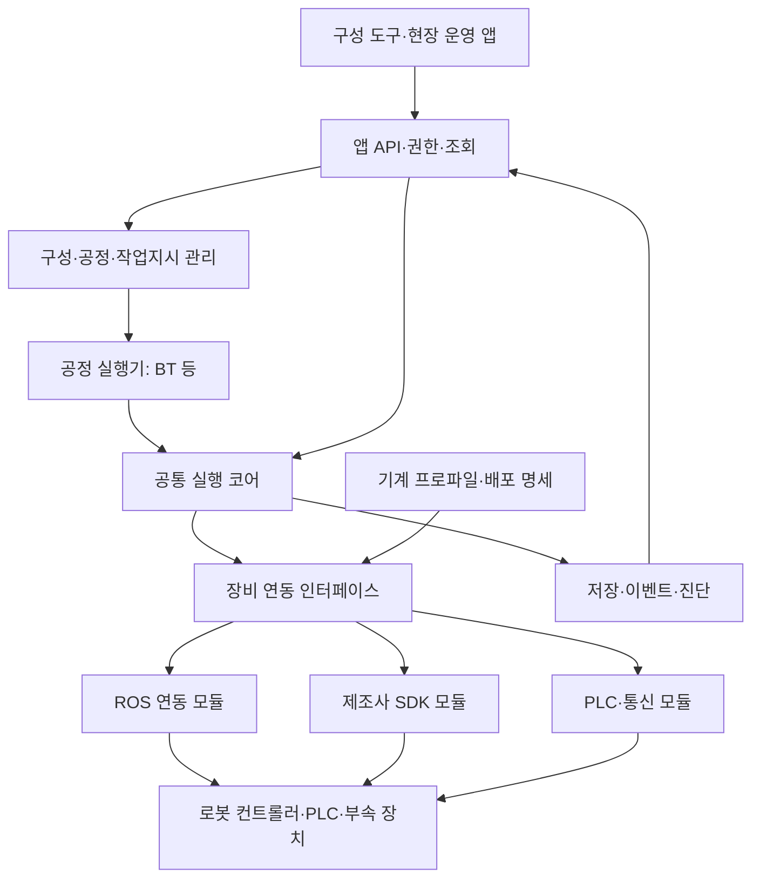

# 05. 소프트웨어 구조와 기술 선택

현재 작업 단계: **설계 문서 작성·구체화**. 실제 코드·빌드 기반·저장소 구축은 설계 정리 후 후속 지시에 따라 진행한다. 진행 순서는 [설계 로드맵](/Users/ojaehong/RX_automation/rx_ws/docs/00_design_roadmap.md)을 따른다.

[전체 문서 안내](/Users/ojaehong/RX_automation/rx_ws/README.md) · 구조·구현 방식은 채택을 위한 권고안

이 장의 후속 구체안: [RX 소프트웨어 구조 제안 v0.1](/Users/ojaehong/RX_automation/rx_ws/docs/10_structure_proposal.md). 첫 프로세스 구성·Core/Operation Service 분담·IPC·저장·패키지와 장애 처리 경계를 제안한다.

## 1. 전체 구조

RX 소프트웨어는 사용자 앱, 구성·공정관리, 현장 실행 서비스, 장비 연동, 저장·진단·배포 지원으로 구성한다. 현재 레포 설계 전제는 공통 제품의 `rx-platform`과 현장 납품물의 `rx-solutions` 두 개다. 실행 프로세스 수와 레포 수는 별개이며 실제 의존성·장애 격리 요구에 따라 배포 경계를 정한다. 실제 레포와 코드는 설계 정리 후 구축한다.



화살표는 주요 호출·정보 흐름이다. 코어 소스가 실제 어댑터나 데이터베이스 구현을 직접 의존한다는 뜻은 아니다. 코어가 정의한 계약을 외부 구현이 제공하고, 실행 서비스가 그 구현들을 조립한다.

## 2. 코어와 Runtime을 구별한다

**코어는 공통 판단·상태 규칙을 구현하는 라이브러리, Runtime은 코어·실행기·저장소·연동 모듈을 조립해 현장에서 동작시키는 서비스**로 정의한다. 코어의 범위를 프로그램 전체와 동일하게 잡지 않는다.

| 구성요소 | 책임 | 경계 밖으로 둘 것 |
|---|---|---|
| 공통 계약 | 장비·능력·작업·관측·결과의 타입과 의미 | ROS 메시지, SDK handle, raw 주소 |
| 실행 코어 | 요청 식별·중복, 실행 상태·공통 조건, 자원 정책, 결과 판정·복구 규칙 | 현장 공정 순서·제조사 통신 |
| 공정 실행기 | 공정별 순서·분기·병행·복구 흐름 선택 | 코어를 우회한 장비 명령 |
| Runtime host | 모듈 조립, 수명주기, worker·이벤트 전달, 서비스 시작·종료 | 공정 의미를 ad hoc로 재정의하는 코드 |
| 어댑터 | SDK·통신 호출, 관측·오류 수집, 기계 프로파일 적용 | 작업지시·실적·UI 정책 |
| 저장 구현 | 계약에 맞는 저장·조회·백업·마이그레이션 | 물리 장비 완료를 임의로 생성하는 판단 |
| 앱·공정관리 | 구성·지시·운영 요청·실적 조회 | 직접 장비 연결·출력 쓰기 |

제조사에 상관없이 유지돼야 하고 여러 공정에서 공유해야 하는 규칙은 코어 후보가 된다. 주로 장비·현장 변경에 따라 바뀌는 것은 모듈·프로파일·공정 패키지 후보가 된다. 두 번째 구현에서 기준이 맞는지 검증한다.

## 3. BT의 위치

BT는 공정 실행 엔진의 후보로 사용할 수 있다. RX가 필요한 것은 다음 작업을 선택하는 기능뿐 아니라 개별 작업의 식별·접수·관측·결론·재시작을 일관되게 관리하는 기능이다. BT 노드는 Runtime에 작업을 요청하고 동일 작업의 상태를 조회한다.

반복 tick이 매번 새 물리 명령을 만들지 않도록 operation ID와 노드 실행 수명을 연결해야 한다. BT 노드의 중단 요청도 실제 장비 정지 확인과 구별한다. BT가 제공하는 SUCCESS/FAILURE/RUNNING에 RX의 모든 결과 의미를 압축하지 않는다.

다른 공정 표현으로 바꿀 수 있게 실행기 경계를 두되, 첫 제품에서 여러 엔진을 동시에 구현하지 않는다. BT 채택은 첫 공정의 작성·진단·중단·재시작 시험과 팀의 운영 편의로 결정한다.

## 4. 어댑터와 기계 프로파일

어댑터는 제조사 SDK나 통신 규약을 사용하는 코드다. 기계 프로파일은 그 코드가 해당 기계에서 어떤 신호·동작·완료 의미로 적용되는지 설명하는 버전 있는 구성과 규칙이다. 단순한 주소 파일로 충분하지 않은 기계는 검증된 PLC 프로그램이나 장비 측 실행 모듈을 함께 필요로 할 수 있다.

| 변경 예 | 우선 변경할 위치 | 재검증 |
|---|---|---|
| SDK 호출 방식 변경 | 어댑터 | 계약·상태·중단·의존 OS |
| 문 센서 주소·극성 변경 | 프로파일·전기/PLC 설정 | 신호 의미·오류·실물 후조건 |
| 소재·지그 변경 | 공정·tool·기구 참조 | 경로·고정·보유·사이클·복구 |
| 공정 순서 변경 | 공정 패키지 | 전제·자원·병행·중단 |
| 중복 요청 정책 수정 | 코어 | 공통 계약·모든 관련 어댑터 회귀 |

확장 SDK에는 등록 정보, 설정 스키마, 기능별 능력 선언, 요청·관측·결과 규약, 수명주기, 예제와 적합성 시험을 제공한다. 개발자가 내부 코어 코드를 복사해서 모듈을 만드는 구조를 피한다.

## 5. ROS와 OS 정책

공통 계약과 코어는 ROS를 필수로 요구하지 않는 방향을 권고한다. OMY 연동에 ROS를 쓰고, 다른 로봇에 네이티브 SDK를 쓰며, 레이저 PLC에 MC 통신을 사용하는 구성을 수용하기 위해서다. ROBOTIS SDK와 UR Client Library는 ROS 밖에서 사용하는 경로를 공식 자료로 제공한다. 이것이 완성된 장비 연동·OS 지원을 대신하지는 않는다. [ROBOTIS SDK](https://docs.robotis.com/docs/software/dynamixel_sdk/overview/), [UR Client Library](https://docs.universal-robots.com/Universal_Robots_ROS_Documentation/rolling/doc/ur_client_library/doc/installation.html)

ROS 모듈을 납품하면 해당 ROS·controller 버전도 제품 지원 대상이다. 비의존 경계는 영향 범위를 제한하며, 유지보수 의무를 없애지 않는다.

| 선택 | 유리한 조건 | 부담·제약 | 이번 권고 |
|---|---|---|---|
| 전체 ROS 기반 | 모든 현장을 같은 ROS·OS 조합으로 관리하고 그 도구를 넓게 활용 | ROS 업그레이드와 이질적 SDK의 영향 범위 관리 | 가능한 대안으로 유지 |
| 코어·계약 독립, 연동에 ROS 허용 | ROS·네이티브 SDK·PLC가 혼재하고 재사용이 중요 | 자체 계약·모듈 시험과 배포 조합 관리 | RX 시작안 |
| PLC·로봇 프로그램 중심의 현장 전용 앱 | 단일 공정·낮은 반복 확장 요구 | 공통 제품 자산과 운영 모델의 재사용 한계 | 단순 현장 대안과 비용 비교 |

OS 이식성은 목표로 유지한다. 첫 납품 환경은 한 OS·CPU 조합으로 좁히는 것을 권한다. 후속 구현 단계에서 로봇 의존성이 맞는다면 Linux를 먼저 검증하고, 코어의 Windows 빌드·모의 시험을 계획한다. **Windows 현장 Runtime·전체 어댑터의 납품 지원 시점은 수요와 SDK 검증에 따라 별도 결정**한다. Windows에서 브라우저 화면을 연다는 사실을 Windows 네이티브 Runtime 지원으로 표시하지 않는다.

## 6. 초기 구현 방식의 권고안

아래는 팀 역량·설치 환경을 확인해 채택할 구체적인 시작안이다. 제품의 공개 약속이나 확정된 기술 표준은 아니다.

| 영역 | 시작안 | 선택 이유와 변경 조건 |
|---|---|---|
| 코어·공통 타입 | C++20, 일반 CMake | 기존 로봇 C++ 연동 경험과 네이티브 배포 활용. 팀 역량 확인 필요 |
| 설정·작업 형식 | 버전 있는 구조화 스키마 | 입력·단위·호환성을 검증하고 언어별 표현 분리 |
| 현장 Runtime | 소수 프로세스로 구성한 모듈식 서비스 | 운영·설치 복잡도를 제한 |
| 앱 | TypeScript 기반 웹 UI와 로컬 서비스 API | 엔지니어·작업자 화면을 역할별로 제공 |
| 장비 모듈 | C++ 또는 제조사가 제공하는 언어 | 실제 SDK에 맞춤. Python/ROS 의존 모듈은 필요 시 별도 host |
| 저장 | 로컬 관계형 저장소, 초기 SQLite 후보 | 한 셀의 작업·이벤트·구성 관리에서 시작. 요구 보장·복구 시험 후 선택 |
| 공정 표현 | 한 개의 엔진, BT 후보 | 표현과 Runtime 계약의 분리 검증 |

저장소 선택은 트랜잭션 의미·장애·백업·배포 요구로 판단한다. SQLite 구현 타입을 도메인 계약에 넣지 않는다. 운영 규모나 공유 writer 요구가 달라지면 저장 구현과 운영 방식의 변경을 검토한다. [SQLite 트랜잭션 문서](https://www.sqlite.org/lang_transaction.html)

처음에는 정적 모듈 등록으로 충분할 수 있다. 동적 라이브러리 로딩은 실제 교체 요구가 있을 때 추가한다. 바이너리 플러그인은 컴파일러·ABI·의존성 조합까지 지원해야 하므로 ‘파일 하나를 넣으면 모든 버전에서 동작’한다고 약속하지 않는다.

## 7. 실행·프로세스 경계

논리적 작업 상태 변경은 순서를 통제한 처리 경로에서 수행한다. 느리거나 blocking인 SDK 호출과 상태 수신은 별도 worker 또는 모듈 host에서 처리하고, 그 결과를 식별된 이벤트로 Runtime에 전달한다. 저장·조회·화면 갱신도 장비 제어의 지연 요구와 분리한다.

별도 프로세스의 모듈은 같은 논리 계약을 버전 있는 메시지로 제공한다. 최초 프로세스 간 통신은 실제 요구를 확인해 하나로 선택한다. 의미 계약과 JSON/Protobuf 같은 직렬화·전송 수단을 구분하며, ROS 메시지 형식이 제품 전체 계약이 되지 않게 한다.

원시 관절·센서의 고주기 제어는 적합한 로봇 제어기·PLC가 맡는다. Runtime은 작업 조정과 결과·운영을 관리한다. 고주기 상태 전체를 작업 원장에 매번 저장하지 않고, 필요한 판단 근거와 진단 스트림의 보존 정책을 나눈다.

## 8. 첫 레이저 셀에 적용한 구성

로봇 어댑터와 Mitsubishi PLC 어댑터는 독립된 장비 기능을 제공한다. 공정 실행기는 이 기능으로 소재 공급 순서를 구성한다. 레이저 PLC 연동 후보는 내장 Ethernet의 MC 통신을 통해 요청·상태 영역을 교환하고, PLC가 기존 CC-Link IO와 기계 동작을 관리하는 방식이다. [현장·공식 자료 대조](/Users/ojaehong/RX_automation/rx_ws/references/laser_plc_interface.md)

RX가 raw 출력 주소를 공정 파일에 직접 넣어 기구를 조작하는 방식보다, PLC가 조건을 판단할 수 있는 명시적 작업 요청·결과 인터페이스를 우선 검토한다. 기존 OEM 인터페이스를 재사용할지 PLC 프로그램을 변경할지는 현장 조사에서 결정한다.

## 9. 향후 두 레포의 논리적 구성 예

```text
rx-platform/
  contracts/           공통 타입·스키마·의미 규약
  core/                공통 실행·판정·복구 규칙
  runtime/             서비스 조립·worker·수명주기
  execution/           공정 실행기
  applications/        구성·운영 API와 UI
  adapters/            로봇·PLC·모의 모듈
  infrastructure/      저장·시간·전송·진단 구현
  examples/            고객 정보가 없는 모의 장비·샘플 패키지
  tests/               계약·장애·통합·회귀 시험
  delivery/            빌드·배포 명세·설치·복원

rx-solutions/
  sites/               실제 현장 구성·장비 프로파일·공정
  tooling/             지그·gripper·tool·교정 revision 참조
  controller-programs/ 장비 프로그램·설정 참조
  ui-extensions/       현장 전용 화면 확장
  validation/          현장 검증·인수 자료
  delivery/            현장별 납품·운영·복구 명세
```

이는 새 구현의 책임 배치를 설명하는 예이며 기존 저장소를 이동하거나 재작성하라는 지시가 아니다. 현장 주소·계정·인수 파일은 접근 범위를 관리한다. 특정 코드를 재사용할지는 계약 적합성·실물 경험·변경 비용을 평가한 뒤 별도로 결정한다.

다음 문서: [06 공통 계약과 신뢰성](/Users/ojaehong/RX_automation/rx_ws/docs/06_contracts_and_reliability.md).
