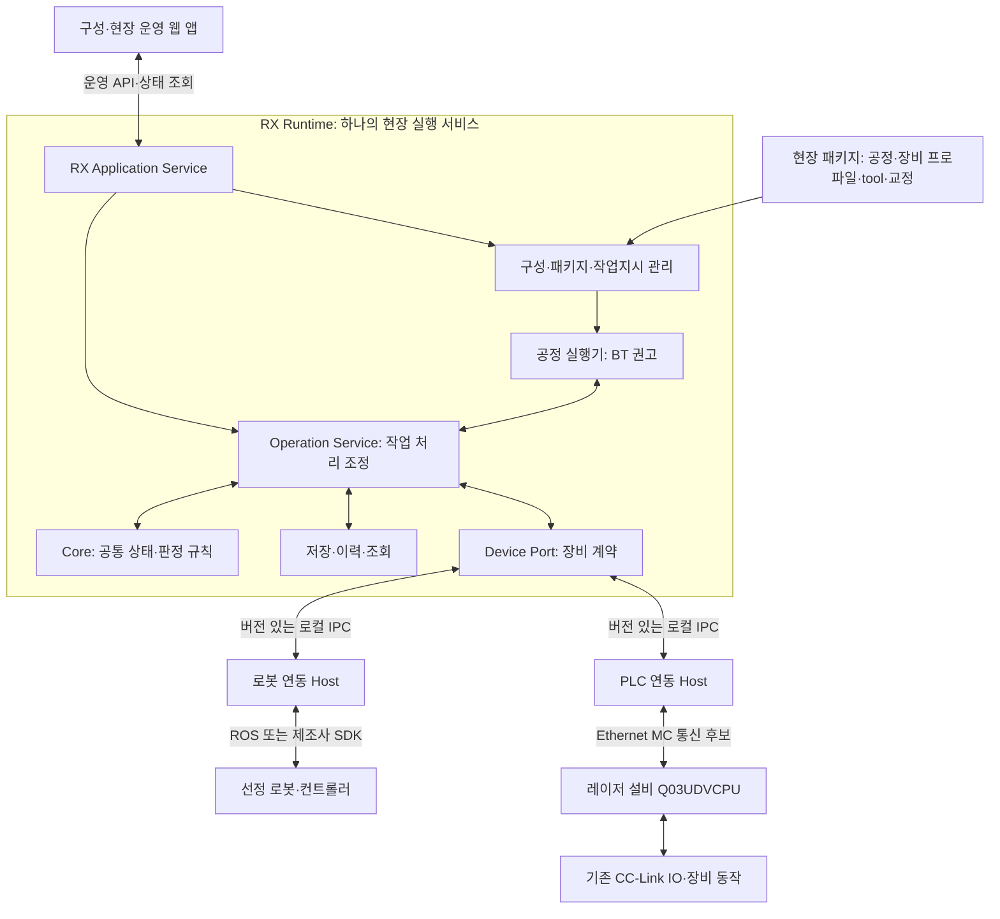

# RX 소프트웨어 구조 제안 v0.1

현재 작업 단계: **설계 문서 작성·구체화**. 실제 코드·빌드 기반·저장소 구축은 설계 정리 후 후속 지시에 따라 진행한다. 진행 순서는 [설계 로드맵](/Users/ojaehong/RX_automation/rx_ws/docs/00_design_roadmap.md)을 따른다.

## 1. 제안하는 구조

**모듈식 현장 Runtime 하나, 장비 제어기별 연동 프로세스, 버전 있는 현장 패키지, 구성·운영 웹 앱으로 시작한다.** Runtime 내부에 공정관리·공정 실행기·공통 실행 코어·저장·진단을 모듈로 나눈다. ROS와 제조사 SDK는 장비 연동 경계에서 사용한다.

이는 [RX 제품 구축 기준](/Users/ojaehong/RX_automation/rx_ws/README.md)의 구체적인 구현 권고안이다. 첫 현장의 장비 사실은 별도 조사·사진 기록을 따른다.[^5] 2026-09-09 기준이며, 기술 선택의 채택·장비 지원·구현 완료를 선언하지 않는다. 기존 저장소나 코드를 이 구조로 이미 변경한 것은 아니다.

이 구조를 선택하는 이유는 두 가지다. 첫 셀은 작게 설치·운영해야 하고, 동시에 로봇 ROS·네이티브 SDK·Mitsubishi PLC의 서로 다른 의존성과 실행 방식을 수용해야 한다. 공통 규칙의 변경과 장비별 변경을 나눠 관리하면서, 처음부터 모든 기능을 개별 서비스로 운영하는 부담을 줄인다.

## 2. 논리적 구성



화살표는 요청·관측의 주요 흐름이다. 소스 의존성은 §7에서 별도로 정의한다. 로봇과 문·척 등의 실제 작업 순서는 공정·신호·기구 조건을 확인해 정한다.

## 3. 구성요소별 책임

| 구성요소 | 구체적으로 맡을 일 | 다른 구성요소에 맡길 일 |
|---|---|---|
| 웹 앱 | 장비 구성·작업 선택·준비·진행·이상·복구·이력 화면 | 장비 직접 호출·독립적인 완료 판정 |
| Application Service | 인증·권한, 운영 명령·조회, 구성·작업지시 사용 사례 | raw 장비 명령과 공통 상태 규칙 |
| Package/Job 관리 | 초안·검증·활성 패키지, 품목·수량·공정 버전·실적 연결 | 장비별 SDK 처리 |
| 공정 실행기 | 순서·분기·병행·공정별 복구 흐름, 작업 ID 연결 | 코어를 우회한 출력·로봇 명령 |
| Operation Service | 요청 처리 순서, 저장 트랜잭션, 장비 전달, 관측 수신·재시작 조정 | 제조사 프로토콜·장비별 물리 의미 |
| Core 라이브러리 | 상태 전이, 요청 동일성, 능력·증거·자원 조건, 결과·재개 판정 | BT·ROS·gRPC·HTTP·SQL 구현 |
| 장비 Host/Adapter | 연결·모드·명령·상태 수집, 프로파일 적용, 원본 오류 해석 | 전체 셀의 작업지시·공정 순서 |
| 저장·진단 | 작업·사건·버전 보존, 조회·집계·백업·진단 묶음 | 물리 작업을 완료했다고 임의 판단 |

이 구분에서 **Core는 라이브러리이고 Runtime은 실행 프로그램**이다. Operation Service는 코어의 결정을 실제 저장·통신 순서로 수행한다. 코어가 직접 네트워크나 데이터베이스를 호출하지 않도록 한다.

## 4. 첫 배포의 프로세스 구성

| 실행 단위 | 첫 역할 | 의존성 |
|---|---|---|
| `rx-runtime` | 앱 API, 패키지·작업지시, BT 실행기, Operation Service, Core, 저장·진단 | 일반 C++ 런타임과 선택한 웹·IPC·저장 라이브러리 |
| `rx-device-host --device robot-1` | 선정 로봇의 작업·관측·중단 연결 | 해당 ROS 또는 SDK 환경 |
| `rx-device-host --device laser-plc-1` | Q03UDVCPU의 합의된 요청·상태 영역과 연결 | Mitsubishi 통신 구현 |
| 브라우저 | 구성·운영 UI | 현장 Runtime의 웹 서비스 |

세 서비스는 같은 메인 PC에서 실행하는 안이다. 실제 로봇·PLC의 기존 제어 프로그램은 장비 측에 남는다. 외부 미니컴퓨터를 RX 원격 worker로 새로 배포하는 요구는 추가하지 않는다.

Host의 경계는 논리 기능 하나보다 **제어기 연결·명령 소유권 단위**로 잡는다. 예를 들어 문·척이 같은 PLC에서 제어된다면 하나의 PLC Host가 그 연결과 명령 순서를 관리하고 여러 기능을 제공한다. 문·척마다 별도 프로세스를 만들어 같은 제어기에 경쟁적으로 쓰지 않는다.

프로세스 분리는 SDK crash·라이브러리 충돌의 영향 범위를 줄이지만 장비의 물리 정지를 보장하지는 않는다. Host 장애 시 Runtime은 의존 관측과 작업을 불명으로 처리하고 후속 허가를 제한한다. 장비 측 단절 대응은 별도로 설정·검증한다.

가짜 장비를 사용하는 최초 코어 시험은 같은 프로세스에서 수행할 수 있다. 장비 Host 경계는 첫 실장비 연동 전에 같은 계약으로 검증한다. 모든 모듈의 동적 로딩이나 운전 중 교체는 초기 필수 범위로 두지 않는다.

## 5. 통신과 인터페이스 선택

### 5.1 앱과 Runtime

운영 요청·조회는 HTTP/JSON API로, 상태 알림은 SSE로 시작하는 안을 권한다. 앱은 상태 snapshot과 갱신 순번을 받아 재접속 시 현재 상태를 다시 맞춘다. 이벤트 스트림만 보고 놓친 완료를 추정하지 않는다. 실제 웹 서버 라이브러리와 인증 방식은 지원 OS·배포 방식에 맞춰 선택한다.

구성·작업지시·실행·중단·복구 확인 API를 구분한다. 화면에서 명령을 다시 보내더라도 같은 요청을 식별할 수 있어야 한다. 운영자가 알림을 읽는 것, 현장을 확인하는 것, 복구 조치를 요청하는 것은 서로 다른 API 의미다.

### 5.2 Runtime과 장비 Host

**Protobuf 메시지와 gRPC를 사용하는 로컬 IPC**를 권고한다. C++ Runtime과 제조사별 다른 언어의 Host를 같은 명세로 연결하고, 요청과 상태 스트림을 정의하기 위한 선택이다. gRPC는 서비스·메시지 정의와 여러 언어의 client/server 구현 경로를 제공한다.[^1]

이 선택에는 생성 코드·의존성·프로세스 시작과 IPC 장애 시험이 추가된다. 그 비용을 감수하는 이유는 장비 의존성과 공통 제품의 배포 경계를 유지하기 위해서다. 모든 현장 네트워크나 로봇 프로토콜을 gRPC로 교체한다는 뜻은 아니다.

| Host 계약 초안 | 의미 |
|---|---|
| `Describe` | Host·어댑터·실제 장비·능력·버전·현재 준비 상태 |
| `BindRuntimeSession` | 허용된 Runtime 실행 세대를 제어 연결에 결합하고 이전 세대의 요청 상태를 조정 |
| `SubmitOperation` | operation ID·내용 동일성·프로파일을 가진 작업 전달 |
| `WatchEvents` | Host 세대·순번을 가진 접수·관측·결과·이상 통지 |
| `GetSnapshot` | 현재 관측·품질·갱신 시각·제어권과 관련 작업 |
| `RequestStop` | 명시한 대상·범위의 중단 요청. 실제 중단 확인은 별도 |
| `ReconcileOperation` | 이전 작업 조회·현재 상태 대조의 지원 범위와 근거 |

`SubmitOperation`의 RPC 성공, Host의 수락, 장비의 접수, 물리 완료를 구별한다. side effect가 있는 요청의 자동 재시도·hedging을 사용하지 않는 설정을 출발점으로 삼고, 동일 작업 ID의 중복 억제를 별도로 구현·시험한다. RPC deadline이나 취소가 실제 장비 정지로 이어졌다고 해석하지 않는다.[^2]

첫 Host의 접수·중복 억제는 메모리 기반으로 시작하며 `acceptance_durability=volatile`로 선언한다. 같은 Host 세대 안에서 operation ID·입력 digest를 대조하고 중복 전달을 억제한다. Host가 재시작하면 이 기록이 없을 수 있다. Runtime은 영속된 전달 이력에 따라 그 작업을 재조정 대상으로 보내고, Host의 기록 부재를 미실행 증거로 해석하지 않는다. 이전 전달 시도가 있는 요청은 일반 Submit으로 자동 재전송하지 않는다.

장비 Host의 세대가 바뀌거나 이벤트 구간이 누락되면 gap을 표시한다. snapshot을 새로 읽는 것만으로 이전 작업의 결론이 복원됐다고 판단하지 않고, 필요하면 작업별 재조정을 수행한다. 임시 큐가 영속 기록처럼 보이지 않게 한다.

전달에는 Runtime 실행 세대·operation ID·입력 digest·프로파일 버전·요청 유효 조건을 포함한다. Host는 장비 전달 직전에 현재 제어권·프로파일·요청 유효성을 대조하고 무효화된 대기 요청을 실행하지 않는다. 이미 장비에 전달됐을 가능성이 있으면 만료만으로 미실행 처리하지 않고 재조정한다.

새 Runtime은 장비 요청 전에 `BindRuntimeSession`을 수행한다. Host는 전송 진입과 세대 교체를 같은 직렬화 경계에서 처리하고, 새 세대를 수락할 때 이전 세대의 확실한 미전달 대기를 무효화한다. 전송에 진입했거나 이미 장비에 전달됐을 가능성이 있는 요청은 재조정 대상으로 남긴다. 이후 옛 세대의 요청은 거부한다. Host도 재시작해 이전 상태를 잃은 경우에는 Runtime의 미결 이력과 장비 상태·잔류 명령을 조정하기 전까지 관련 신규 동작을 허가하지 않는다.

Host의 작업 접수는 길게 실행되는 SDK 호출과 분리한다. 상태 수신과 중단 요청도 일반 동작의 blocking 대기 때문에 막히지 않도록 별도 처리 경로를 둔다. 같은 SDK 객체를 여러 스레드가 안전하게 호출할 수 있는지는 제조사 지원·시험으로 확인하며, 불가능하면 해당 제어기에 맞는 다른 중단 경로 또는 제한을 명시한다.

IPC는 기본적으로 로컬에 제한하고 등록·허용된 Host만 사용한다. 로컬 연결이라는 이유로 권한·명령 소유권을 생략하지 않는다. 여러 PC로 확장할 때는 인증·네트워크 단절·제어권·운영 책임을 별도로 설계한다.

## 6. 공정 실행기와 코어의 관계

공정 실행기는 첫 구현에서 **BehaviorTree.CPP 기반 BT**를 사용하는 안을 권한다. BT 라이브러리는 execution 모듈에만 두고, 노드는 ROS나 PLC를 직접 호출하는 대신 Operation Service를 호출한다. 공식 ROS wrapper는 별도의 연동 방식이며 RX 공정 노드에 그대로 적용해야 하는 요구는 아니다.[^3]

| 일 | 담당 |
|---|---|
| 어떤 공정 버전으로 무엇을 얼마나 처리할지 | Job/Application Service |
| 현재 조건에서 어느 단계를 선택할지 | BT 공정 실행기 |
| 해당 요청을 지금 수락·전달할 수 있는지 | Operation Service와 Core |
| 장비 명령과 관측을 어떤 규약으로 교환할지 | Host/Adapter |
| 장비별 신호가 뜻하는 상태 | 기계 프로파일을 적용한 Adapter |
| 그 증거가 이번 작업의 결론·다음 허가에 충분한지 | Core와 정의된 공정 조건 |

노드의 한 실행 활성화에서 operation ID를 하나 생성·보존하고, 반복 tick은 그 작업의 상태를 조회한다. 반복 공정의 다음 활성화는 새로운 논리 작업으로 구분한다. 공정 버전·단계 활성화·작업 ID·필요한 변수·분기 선택을 저장 가능한 checkpoint로 정의한다.

재시작은 BT 메모리를 그대로 이어 실행하는 것으로 구현하지 않는다. 기록된 checkpoint와 현재 장비·미결 작업을 대조한 뒤 어느 단계에서 재개할지 판단한다. `UNKNOWN`을 일반 FAILURE로 바꿔 자동 fallback·retry를 실행하지 않는다. 영향받는 공정 흐름을 보류하고 명시적인 재조정·복구 경로로 넘긴다.

## 7. 소스 의존성과 저장 방식

의존성은 다음 방향으로 제한한다.

```text
contracts       → 공통 타입과 IOperationService·IDevicePort·IExecutionStore 등의 선언
core            → contracts, C++ 표준 라이브러리
application     → core, contracts: Operation Service·사용 사례 구현
execution-bt    → contracts의 IOperationService, BT 라이브러리
adapters        → contracts/Host SDK, 제조사 SDK 또는 ROS
infrastructure  → 정의된 저장·전송 계약, SQLite·gRPC 등
runtime         → application·execution·infrastructure 등 실제 구현을 조립
web-app         → 공개 앱 API·뷰 모델
```

작업 인터페이스는 Runtime 실행 파일의 구현과 분리된 `contracts`에 선언한다. Operation Service는 `application` 모듈에 구현하고, 저장·장비 포트의 실제 구현은 Runtime 조립 시 주입한다. 따라서 BT 모듈과 Operation Service 사이에 실행 파일을 통한 순환 의존을 만들지 않는다.

Protobuf schema·생성 코드는 별도의 `protocol` 영역에 두고 네트워크 경계에서 도메인 타입으로 변환한다. Core에 generated RPC 타입이나 SQLite connection을 직접 넣지 않는다. 기계별 raw register·topic·SDK 오류 코드는 어댑터·프로파일·진단 영역에 둔다.

저장은 **Runtime 하나가 쓰는 로컬 SQLite**로 시작하는 안을 권한다. 작업 현재 상태, 요청·이벤트, 적용 버전, 공정 checkpoint, 개입 기록을 보존한다. 같은 논리 상태 변경은 하나의 트랜잭션으로 묶는다. SQLite는 동시 read를 지원하지만 동시 write transaction은 하나이므로 초기 단일 writer 구조와 맞춰 검증한다.[^4]

장비 전달 전 필요한 의도를 기록한다. 전송 결과·장비 접수·관측·결론은 이후 구분해 기록한다. commit 여부가 불명하거나 저장에 실패하면 관련 신규 전달을 허가하지 않는다. 저장과 장비 물리 동작은 원자적이지 않으며, 재시작 때 모든 전송 대기를 자동 재전송하지 않는다.

위 제한의 대상은 새로운 작업 동작의 전달이다. 이미 진행 중인 작업의 중단 요청은 일반 작업 큐·저장 대기와 분리해, 저장 장애가 중단 요청 경로까지 막지 않도록 설계한다. 기록 실패·요청 실패는 별도로 표시하고 실제 정지 여부는 관측한다. 이 경로도 설비의 독립적인 보호 기능을 대체하지 않는다.

고주기 원시 센서 데이터는 진단 스트림으로 별도 관리한다. 작업 판정에 사용한 근거는 그 출처·품질·버전과 함께 보존한다. 이벤트나 진단 큐의 용량·누락·역압력 정책을 정하고, 상태 스트림이 조용히 멈추어도 정상으로 보이지 않게 한다.

## 8. 현장 패키지와 플러그인

### 8.1 현장 패키지

```text
laser-cell-package/
  manifest              패키지·계약·모듈 버전과 해시
  devices/              실제 장비 식별·Host 구성·프로파일 참조
  profiles/             신호·모드·단위·능력·접수·완료·중단 규칙
  processes/            BT 정의·입력·조건·복구·checkpoint 규칙
  tooling/              지그·gripper·tool·교정 revision 참조
  controller-programs/  PLC·로봇 프로그램의 배포 참조·해시
  validation/           적합성·실물·셀 시험 결과와 범위
  operations/           작업자 개입·복구·인수 절차
```

자료형·파일 형식은 후속 명세에서 정한다. 위 목록은 논리 구성이다. 초안·검증·활성 버전을 구분하고 실행에는 고정된 패키지를 적용한다. 계정 비밀은 패키지에 넣지 않는다.

프로파일의 완료 규칙은 검증 가능한 형식으로 정의한다. 제조사별 복잡한 의미 변환은 어댑터 또는 검증된 장비 측 프로그램에 두고 그 버전을 참조한다. 자유 문자열 설정만 바꿔 안전·완료 의미를 임의로 재정의하는 구조로 만들지 않는다.

### 8.2 장비 확장 모듈

새 장비 개발자는 Host SDK, 공통 계약, 모의 참조 구현, 적합성 시험을 받는다. 제조사별 구현과 능력·설정 schema를 작성하고 기계 프로파일로 검증한다. 설치된 모듈의 manifest와 승인된 지원 조합을 대조한 뒤 Runtime에서 등록한다.

첫 버전의 플러그인 단위는 교체·등록 가능한 **장비 Host 구현 패키지**다. 각 Host 내부는 정적 조립으로 시작할 수 있다. 범용 C++ 바이너리 ABI, 운전 중 hot reload, 모든 SDK의 임의 설치를 처음부터 지원하지 않는다.

로봇 교체 시 코어와 앱 API의 재사용을 목표로 한다. 실제로는 tool·경로·품목·gripper·프로파일과 셀 검증이 달라질 수 있다. ‘어댑터 하나만 바꾸면 모든 공정이 검증 없이 동작’하는 호환성을 약속하지 않는다.

## 9. 작업 하나의 실행 예

아래 문 닫기는 구조 설명용 작업이며 실제 레이저 신호·조건이 확정된 절차가 아니다.

1. 작업자가 검증된 공정·품목을 선택해 시작한다. Application Service가 주체·활성 패키지·준비 조건을 확인한다.
2. BT가 문 닫기 작업을 선택하고 Operation Service에 같은 활성화 ID의 요청을 보낸다.
3. Core가 요청 동일성·능력·증거·자원 조건을 판정한다. Operation Service가 의도를 저장한 뒤 PLC Host에 전달한다.
4. PLC Host가 프로파일에 정의된 handshake로 요청을 보낸다. Host 수락과 PLC 접수 사실을 각각 통지한다.
5. PLC가 제공한 관측·결과를 요청과 연관시키고, Core가 정의된 완료 근거를 확인한다.
6. 결과·checkpoint를 저장하고 BT와 앱에 전달한다. 다음 작업은 자신의 전제·자원 조건이 충족될 때만 진행한다.

응답을 잃으면 결론 불명과 영향받는 자원 제한을 기록한다. 재접속 후 요청 결과·잔류 명령·현재 상태를 대조한다. 판별할 수 없으면 정의된 현장 확인 절차를 따른다. RPC 재연결·프로세스 자동 재기동을 공정 자동 재개와 연결하지 않는다.

## 10. 설계 완료 후의 구현 순서와 비용

| 순서 | 구현물 | 검증할 핵심 |
|---|---|---|
| 1 | `contracts`, Core, 인메모리 모의 장비 | 정상·거부·중복·불명·중단 경합 |
| 2 | Operation Service, SQLite, 작은 운영 화면 | 요청·기록·결과의 연결, 저장 실패·재시작 |
| 3 | Device Port의 gRPC proxy와 모의 Host | 프로세스 종료·세대 변경·이벤트 누락·재조정 |
| 4 | 선정 로봇·Mitsubishi PLC Host와 실제 프로파일 | 실제 접수·관측·완료·중단·제어권 |
| 5 | 첫 BT 공정과 패키지·checkpoint | 반복 tick·공정 중단·재시작이 중복 동작을 만들지 않음 |
| 6 | 구성·교육·배포·진단·복원 완성 | 다른 담당자의 설치·운영·지원 |

현재는 이 구현 순서를 작업 명세와 시험 시나리오로 구체화한다. 설계 정리 후 코드 착수 단계에서 필요한 현장·PLC·기구 조사와 구현을 병행한다. 실제 동작에 필요한 책임·관측·보호 조건은 해당 물리 시험 전에 확보한다.

추가 비용은 Host·IPC·버전·복구 시험이다. 그 대가로 SDK 의존성 격리, 언어별 연동, 모의 장비의 재사용과 납품 조합 관리가 쉬워질 것으로 기대한다. 이 효과는 첫 실장비와 두 번째 이질적 장비의 변경·지원 비용으로 확인한다.

단일 Runtime의 고장은 셀 운영에 영향을 준다. 초기에는 이 범위를 명시하고 장비 측 단절 동작·복구를 검증한다. 가용성 요구가 별도로 생기면 제어권·기록·장비 능력을 함께 검토해 고가용성 구성을 설계한다. 처음부터 Runtime을 두 개 띄워 같은 장비에 쓸 수 있게 하지 않는다.

## 11. 확정 전에 확인할 항목

첫 로봇·SDK/ROS 설치 환경, Q03UDVCPU의 현재 Ethernet·PLC 프로그램·OEM 변경 범위, 실제 문·척·가공 신호, 운영자 개입과 보호 기능 경계가 남아 있다. C++20·BT·SQLite·gRPC·웹 API는 이번 구체 권고이며 팀 역량·지원 OS·현장 제약으로 최종 선택한다.

첫 배포는 적합한 Linux 조합 하나로 검증하는 안을 유지하고, Core의 Windows 빌드·모의 시험을 병행한다. Windows에서 UI를 보는 것과 전체 Runtime·Host를 네이티브로 납품하는 것을 구분한다. ROS를 사용하는 Host의 ROS 버전 유지보수도 제품 책임에 포함한다.

## Sources

[^1]: gRPC, [Introduction](https://grpc.io/docs/what-is-grpc/introduction/), 서비스·메시지 정의와 client/server 구현. 2026-09-09 확인. RX의 로컬 IPC 채택은 본 문서의 제안.
[^2]: gRPC, [Deadlines](https://grpc.io/docs/guides/deadlines/), [Cancellation](https://grpc.io/docs/guides/cancellation/), [Retry](https://grpc.io/docs/guides/retry/). 통신 호출의 deadline·취소·재시도 의미를 장비 동작과 구분하기 위한 참고. RX의 물리 중복 억제·중단 보장은 장비 계약과 실물 검증 필요.
[^3]: BehaviorTree.CPP, [Integration with ROS2](https://www.behaviortree.dev/docs/ros2_integration/), 문서 표시 4.8, 2026-09-09 확인. ROS wrapper와 BT node의 연동 예. RX의 Operation Service를 사용하는 노드와 코어 경계는 별도 제안.
[^4]: SQLite, [Transaction](https://www.sqlite.org/lang_transaction.html), 동시 read/write 및 트랜잭션 오류. 2026-09-09 확인. 설정·저장 장치·복원 시험 없이 내구성 전체를 보장하지 않음.
[^5]: RX 내부 요구·현장 사실: [제품 기준](/Users/ojaehong/RX_automation/rx_ws/README.md), [첫 셀 계약](/Users/ojaehong/RX_automation/rx_ws/docs/11_first_cell_contract.md), [레이저 PLC 기록](/Users/ojaehong/RX_automation/rx_ws/references/laser_plc_interface.md). Q03UDVCPU 모델 확인과 MC 연동 후보의 근거이며 실제 접속·작업 지원 완료는 아님.
